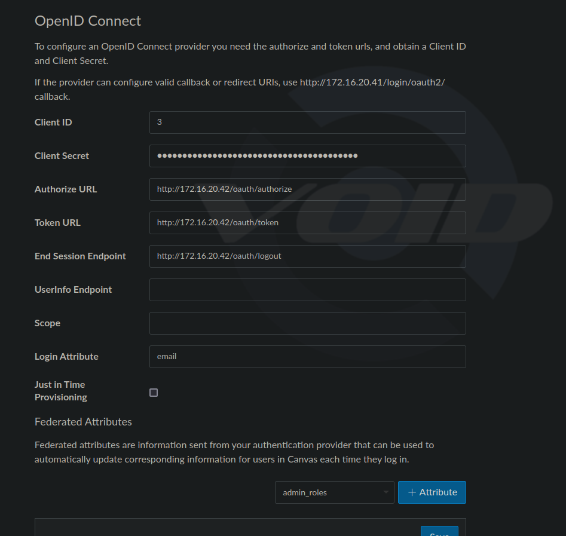

## Canvas Authentication Setup for UnlockEdV2

Currently UnlockEdV2 is setup to be an authentication provider for CanvasLMS through the OpenID Connect Protocol, which acts as an identity layer on top of OAuth2.0. This will be crucial for our users to be able to log in to their Canvas accounts through UnlockEd.

Our default Auth provider for session based logins is Laravel Passport, which can also be used as an OAuth2 server. However, in order to support OpenID Connect, we needed to use a package called `jeremy379/laravel-openid-connect` which is a Laravel specific fork of `ronvanderheijden/openid-connect`, which adds OIDC support to Laravel Passport.

**Note:** There is an `Action` endpoint that provides an RPC style API for the front end to call, which will do this for you located at `api/v1/actions/register-canvas-auth` which takes a POST request with JSON payload containing the ID of the ProviderPlatform, and alternatively the `authentication_url` if this is different from the base_url stored in the ProviderPlatform table. This is the recommended way to set up Canvas Authentication.

The main steps to setup Canvas Authentication are as follows, this assumes that both packages have been installed and migrations have been ran:
`sail artisan passport:install`
(if this command has been ran previously, you may need to add a `--force` flag to overwrite the existing keys)
Running the following commands to publish the configuration files for the packages:

`sail artisan vendor:publish --tag=openid`
which will expose a new file `config/openid.php` which will allow you to configure the OIDC settings.

and `sail artisan vendor:publish --tag=passport-config`

which will expose a new file `config/passport.php` which will allow you to configure the Passport settings.
`In`app/Providers/AuthServiceProvider.php`:

```php
    public function boot(): void
    {
        Passport::hashClientSecrets();
        $scopes = config('openid.passport.tokens_can'); // This is a list of scopes that the API can provide, configurable in "config/openid.php"
        Passport::tokensCan($scopes);
        Passport::setDefaultScope($scopes);
    }
```

This will provider the default scopes for the API, which is required for the OIDC package to work correctly.

In `config/auth.php`

```php
    'guards' => [
        'web' => [
            'driver' => 'session',
            'provider' => 'users',
        ],
        'api' => [
            'driver' => 'passport', // the default guard for the API needs to be passport
            'provider' => 'users',
        ],
    ],
```

and in `App/Http/Kernel.php` the following middleware needs to be added to the end of the `$middlewareGroups` array:

```php
    protected $middlewareAliases = [
        /.....
        'scopes' => \Laravel\Passport\Http\Middleware\CheckScopes::class,
        'scope' => \Laravel\Passport\Http\Middleware\CheckForAnyScope::class,
    ],
```

and the User model needs to implement the `HasApiTokens` trait, being sure that it is the Passport version of this trait.

```php
use Laravel\Passport\HasApiTokens;

class User extends Authenticatable
{
    use HasApiTokens, HasFactory, Notifiable;
```

To handle the OpenID Identity aspect, we need to create a class to handle the OIDC configuration, which will serve as the Entity, and handle the OIDC flow. This is done in `app/Entities/UserEntity.php`:

```php
<?php

namespace App\Entities;

use App\Models\User;
use League\OAuth2\Server\Entities\Traits\EntityTrait;
use OpenIDConnect\Claims\Traits\WithClaims;
use OpenIDConnect\Interfaces\IdentityEntityInterface;

class IdentityEntity implements IdentityEntityInterface
{
    use EntityTrait;
    use WithClaims;

    protected User $user; // This is the user model that will be used to generate the claims

    public function setIdentifier($identifier): void
    {
        $this->identifier = $identifier;
        $this->user = User::findOrFail($identifier); // Trait implementation
    }

    public function getClaims(): array
    {
        return [
            'email' => $this->user->email, // We are using the 'email' field as the unique identifier
        ];
    }
}
```

What this is doing, is implementing the Entity trait from the OIDC package, and the `IdentityEntityInterface` which requires the `setIdentifier` and `getClaims` methods to be implemented. This will allow us to use the `IdentityEntity` as the OIDC entity for our users, allowing us to provide a JWK consistent with the OIDC standard.

In Canvas, we will need to create a Developer Key if we wish to do this from the API, or you can log in as the SiteAdmin and create an Authentication Provider for OpenID Connect. This will prompt you for a `client_id` and `client_secret`, which we can generate using the command: `sail artisan passport:client`


The passport command will prompt you for the callback URL, which canvas provides you in the UI as seen, but it is by default `https://{canvas_base_url}/auth/callback`.

It is important to note that the `userinfo` URL should be left blank, as the OIDC package will handle this for us in the JWK.

In order for a user to successfully log in to Canvas through UnlockEd, the user must exist in Canvas as well as in UnlockEd, and the `email` field must match. Additionally, a `login` must be created for the appropriate user in Canvas, with UnlockEd's AuthProviderID. There is an `Action` RPC for this setup at the route `api/v1/actions/create-canvas-login` This accepts a POST with the JSON body with the `user_id` and respective `provider_platform_id` associated with the login. This will create the necessary Login in Canvas for the user, and requires Canvas to already have been configured as an Auth provider in UnlockEd through the other `Action`, as the other action will save the correct AuthProviderId associated with UL in Canvas.

NOTE: All of the above has been configured and is already implemented in UnlockEd, and the `Action` endpoints are the recommended way to set up Canvas Authentication. Issues typically arise from the Userinfo not being sent to Canvas properly, so make sure that the 'userinfo' field is left blank when configuring the auth provider in canvas if done by hand. This will cause a conflict if the id token doesn't have the same field as the endpoint.

With those two Actions endpoints, there is no need for further manual configuration of passport/OIDC settings in UnlockEd.
