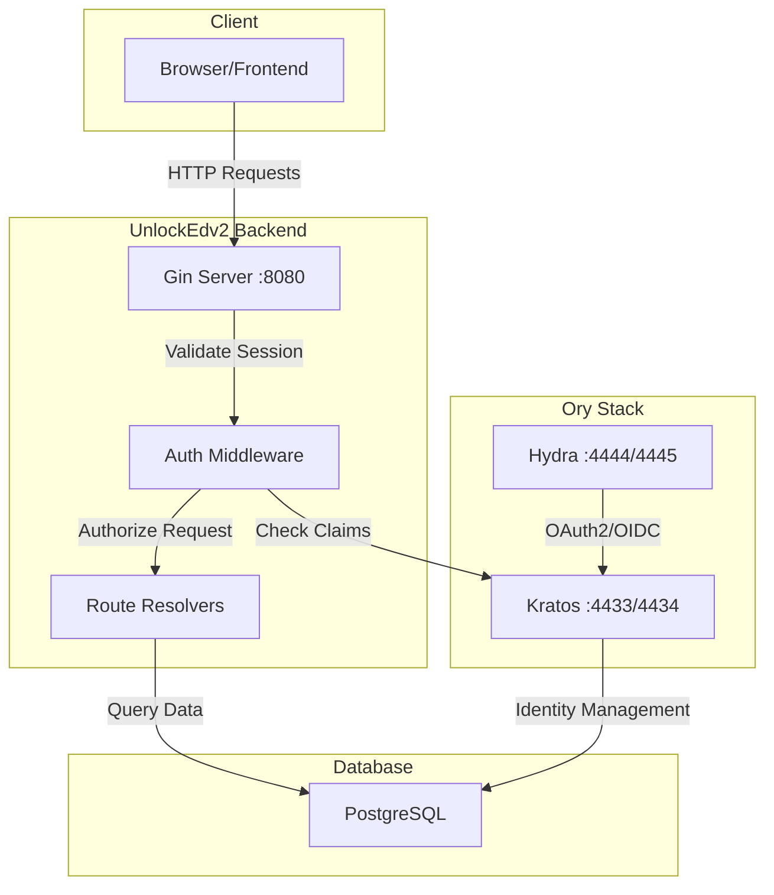
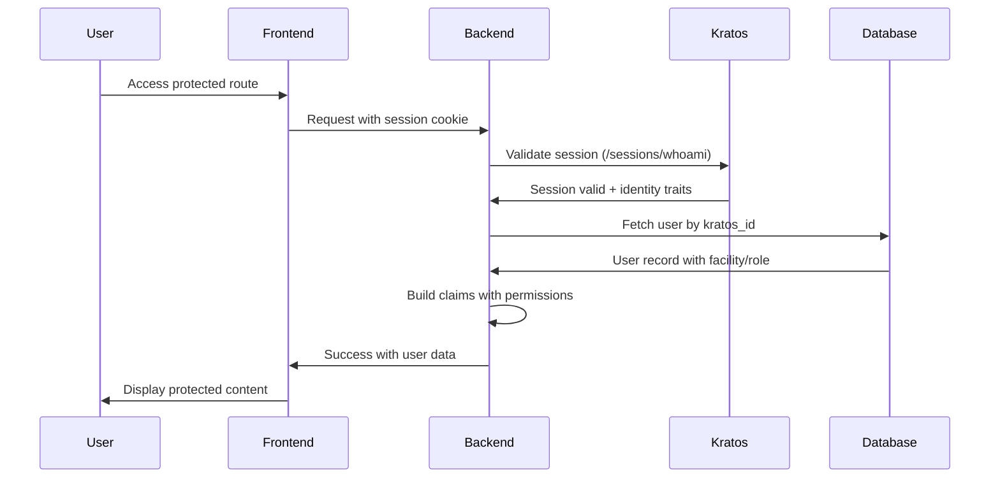
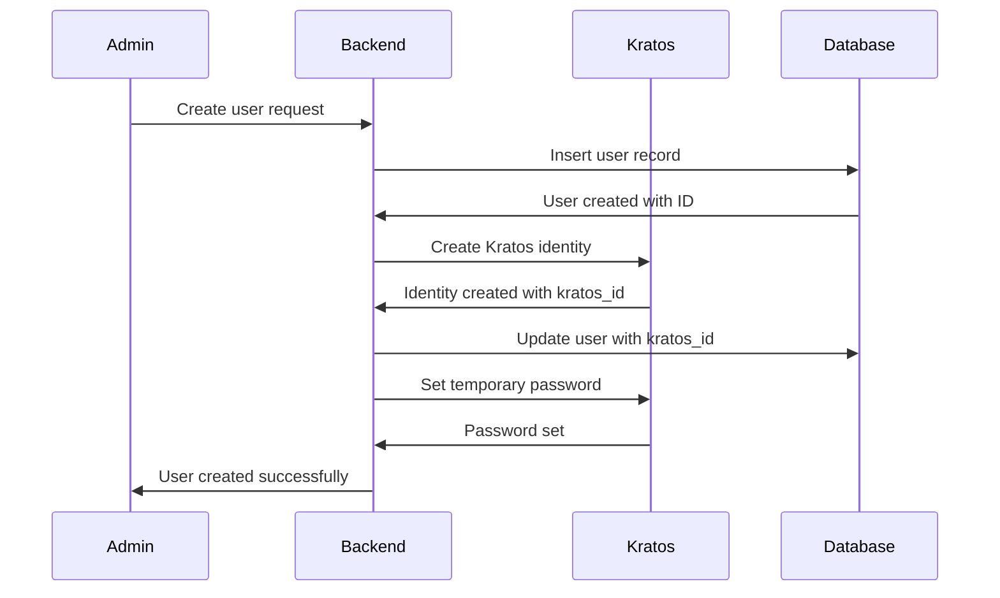
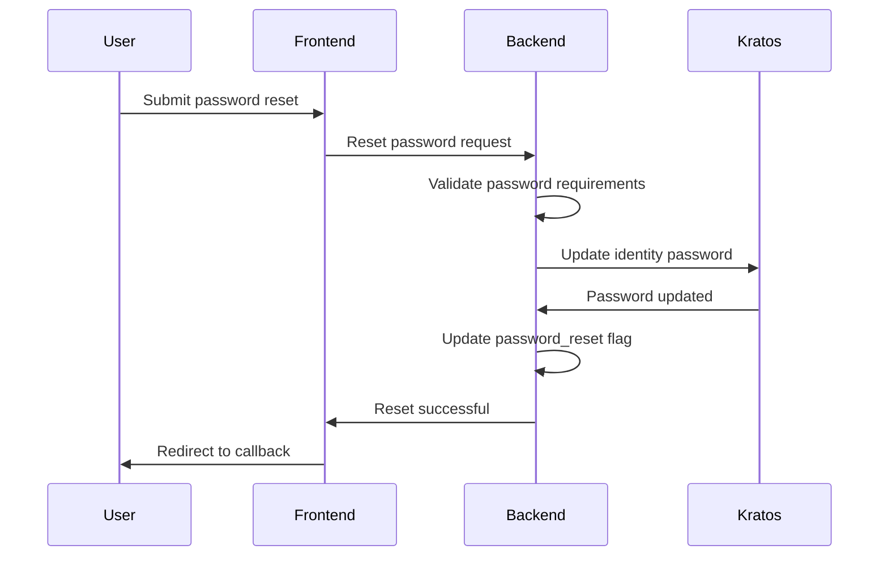
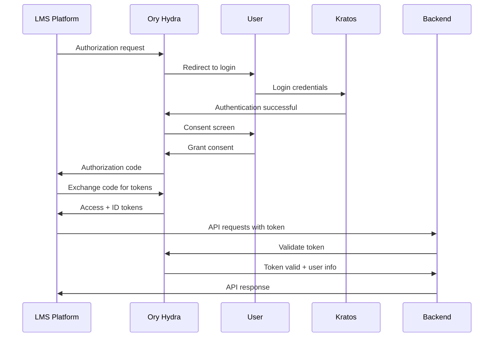

# Authentication & Authorization Documentation

This document provides comprehensive documentation for UnlockEdv2's authentication and authorization system, built on Ory Kratos and Ory Hydra with role-based access control and multi-tenant facility isolation.

## 📋 Table of Contents
- [System Overview](#system-overview)
- [Architecture](#architecture)
- [Authentication Flow](#authentication-flow)
- [Authorization Model](#authorization-model)
- [Role-Based Access Control](#role-based-access-control)
- [Multi-Tenancy](#multi-tenancy)
- [Session Management](#session-management)
- [OAuth2/OIDC Integration](#oauth2oidc-integration)
- [Security Features](#security-features)
- [Implementation Details](#implementation-details)
- [Configuration](#configuration)
- [Troubleshooting](#troubleshooting)

## 🏗️ System Overview

UnlockEdv2 implements a sophisticated authentication and authorization system designed for correctional facility environments with strict security requirements and multi-tenant isolation.

### Key Components
- **Ory Kratos**: Identity management and authentication
- **Ory Hydra**: OAuth2/OIDC authorization server
- **Custom RBAC**: 4-tier role-based permission system
- **Multi-tenancy**: Facility-based data isolation
- **Feature Flags**: System-wide access control
- **Session Tracking**: Comprehensive audit trails

### Security Principles
- **Zero Trust**: Verify every request
- **Least Privilege**: Minimal required permissions
- **Defense in Depth**: Multiple security layers
- **Audit Everything**: Comprehensive logging
- **Facility Isolation**: Strict data segregation

## 🏛️ Architecture

### Component Interaction


### Authentication Stack
```
┌─────────────────────────────────────────┐
│             Frontend App                │
│        React + TypeScript               │
└─────────────────┬───────────────────────┘
                  │ HTTP Requests + Cookies
┌─────────────────▼───────────────────────┐
│          Auth Middleware                │
│     - Session Validation               │
│     - Claims Extraction                │
│     - Feature Access Check             │
└─────────────────┬───────────────────────┘
                  │ Validated Claims
┌─────────────────▼───────────────────────┐
│        Route Resolvers                  │
│     - Facility Access Control          │ 
│     - Role-Based Permissions           │
│     - Resource Authorization           │
└─────────────────┬───────────────────────┘
                  │ Authorized Request
┌─────────────────▼───────────────────────┐
│          Route Handlers                 │
│     - Business Logic                   │
│     - Database Operations              │
│     - Response Generation              │
└─────────────────────────────────────────┘
```

---

## 🔐 Authentication Flow

### Standard Login Flow


### Registration Flow


### Password Reset Flow


---

## 🛡️ Authorization Model

### Claims Structure
```go
type Claims struct {
    Username      string                 `json:"username"`
    Email         string                 `json:"email"`  
    UserID        uint                   `json:"user_id"`
    Role          UserRole               `json:"role"`
    FacilityID    uint                   `json:"facility_id"`
    FacilityName  string                 `json:"facility_name"`
    KratosID      string                 `json:"kratos_id"`
    FeatureAccess []FeatureAccess        `json:"feature_access"`
    SessionID     string                 `json:"session_id"`
    DocID         string                 `json:"doc_id"`
    TimeZone      string                 `json:"timezone"`
    PasswordReset bool                   `json:"password_reset"`
}
```

### Permission Methods
```go
// Administrative privileges
func (c *Claims) isAdmin() bool {
    return slices.Contains(models.AdminRoles, c.Role)
}

// Multi-facility access capability
func (c *Claims) canSwitchFacility() bool {
    return slices.Contains([]models.UserRole{
        models.SystemAdmin, 
        models.DepartmentAdmin
    }, c.Role)
}

// Feature access validation
func hasFeatureAccess(feature FeatureAccess) bool {
    return slices.Contains(c.FeatureAccess, feature)
}
```

### Middleware Chain
```go
func (srv *Server) applyStandardMiddleware(next http.Handler, resolver RouteResolver) http.Handler {
    return srv.prometheusMiddleware(          // 4. Metrics collection
        srv.authMiddleware(                   // 3. Authentication validation
            srv.checkFeatureAccessMiddleware( // 2. Feature flag validation  
                srv.handleError(               // 1. Error handling
                    next), 
                accessLevel...),
            resolver))                        // 5. Route-specific authorization
}
```

---

## 👥 Role-Based Access Control

### Role Hierarchy
```go
type UserRole string

const (
    SystemAdmin     UserRole = "system_admin"      // Full system access
    DepartmentAdmin UserRole = "department_admin"  // Multi-facility oversight
    FacilityAdmin   UserRole = "facility_admin"    // Single facility administration  
    Student         UserRole = "student"           // Learning platform access
)

// Hierarchical permissions (higher roles inherit lower permissions)
var AdminRoles = []UserRole{FacilityAdmin, DepartmentAdmin, SystemAdmin}
```

### Permission Matrix

| Operation | Student | Facility Admin | Department Admin | System Admin |
|-----------|---------|----------------|------------------|--------------|
| **User Management** |
| View own profile | ✅ | ✅ | ✅ | ✅ |
| Edit own profile | ✅ | ✅ | ✅ | ✅ |
| View facility users | ❌ | ✅ | ✅ | ✅ |
| Create users | ❌ | ✅ | ✅ | ✅ |
| Transfer users | ❌ | ❌ | ✅ | ✅ |
| **Program Management** |
| View programs | ✅ | ✅ | ✅ | ✅ |
| Enroll in programs | ✅ | ❌ | ❌ | ❌ |
| Manage enrollments | ❌ | ✅ | ✅ | ✅ |
| Create programs | ❌ | ✅ | ✅ | ✅ |
| **Facility Management** |
| View facility data | ✅ | ✅ | ✅ | ✅ |
| Switch facility context | ❌ | ❌ | ✅ | ✅ |
| Create facilities | ❌ | ❌ | ❌ | ✅ |
| **System Administration** |
| View system metrics | ❌ | ❌ | ✅ | ✅ |
| Manage feature flags | ❌ | ❌ | ❌ | ✅ |
| Provider platform setup | ❌ | ❌ | ❌ | ✅ |

### Route Protection Examples

#### Admin-Only Routes
```go
// System administration (system admin only)
adminFeatureRoute("GET /api/feature-flags", srv.handleGetFeatureFlags, models.SystemAdminOnly)

// User management (any admin)
adminRoute("GET /api/users", srv.handleGetUsers)
adminRoute("POST /api/users", srv.handleCreateUser)

// Facility management (department admin or higher)
adminRoute("GET /api/facilities", srv.handleGetFacilities)
```

#### Resource-Specific Authorization
```go
// User can only access their own data or admin can access facility users
userRoute("GET /api/users/{id}", srv.handleGetUser, UserRoleResolver("id"))

// Admin can only manage users in their facility (unless system/dept admin)
adminRoute("PUT /api/users/{id}", srv.handleUpdateUser, UserRoleResolver("id"))

// Facility-scoped resource access
adminRoute("GET /api/classes/{id}", srv.handleGetClass, FacilityAdminResolver("program_classes", "id"))
```

---

## 🏢 Multi-Tenancy

### Facility Isolation Model
```go
// All data queries are facility-scoped by default
func (db *DB) GetUsersByFacility(facilityID uint) ([]User, error) {
    var users []User
    return users, db.Where("facility_id = ?", facilityID).Find(&users).Error
}

// Admins with multi-facility access can override scope
func (db *DB) GetUsersWithScope(claims *Claims) ([]User, error) {
    query := db.Model(&User{})
    
    if !claims.canSwitchFacility() {
        query = query.Where("facility_id = ?", claims.FacilityID)
    }
    
    var users []User
    return users, query.Find(&users).Error
}
```

### Route Resolvers

#### Facility-Based Authorization
```go
// FacilityAdminResolver checks if user can access facility-scoped resources
func FacilityAdminResolver(table string, param string) RouteResolver {
    return func(tx *database.DB, r *http.Request) bool {
        claims := r.Context().Value(ClaimsKey).(*Claims)
        
        // System/Department admins can access any facility
        if claims.canSwitchFacility() {
            return true
        }
        
        // Extract resource ID from URL
        id := r.PathValue(param)
        
        // Verify resource belongs to user's facility
        var facilityID uint
        err := tx.Table(table).
            Select("facility_id").
            Where("id = ?", id).
            Limit(1).Scan(&facilityID).Error
            
        return err == nil && claims.FacilityID == facilityID
    }
}
```

#### User-Specific Authorization
```go
// UserRoleResolver checks if user can access user-specific resources
func UserRoleResolver(routeId string) RouteResolver {
    return func(tx *database.DB, r *http.Request) bool {
        claims := r.Context().Value(ClaimsKey).(*Claims)
        
        // Multi-facility admins can access all users
        if claims.canSwitchFacility() {
            return true
        }
        
        id, err := strconv.Atoi(r.PathValue(routeId))
        if err != nil {
            return false
        }
        
        // Users can access their own resources
        if claims.UserID == uint(id) {
            return true
        }
        
        // Non-admin users can't access others' resources
        if !claims.isAdmin() {
            return false
        }
        
        // Facility admins can access users in their facility
        user, err := tx.GetUserByID(uint(id))
        return err == nil && user.FacilityID == claims.FacilityID
    }
}
```

### Context Switching
```go
// System/Department admins can switch facility context
func (srv *Server) handleSwitchFacility(w http.ResponseWriter, r *http.Request) error {
    claims := r.Context().Value(ClaimsKey).(*Claims)
    
    if !claims.canSwitchFacility() {
        return newUnauthorizedServiceError()
    }
    
    facilityID, err := strconv.Atoi(r.PathValue("facility_id"))
    if err != nil {
        return newBadRequestServiceError(err, "Invalid facility ID")
    }
    
    // Update session traits in Kratos
    traits := claims.getTraits()
    traits["facility_id"] = facilityID
    
    err = srv.updateUserTraitsInKratos(claims)
    if err != nil {
        return newInternalServerServiceError(err, "Failed to update session")
    }
    
    return writeJsonResponse(w, http.StatusOK, "Facility context updated")
}
```

---

## 📱 Session Management

### Session Validation
```go
func (srv *Server) validateOrySession(r *http.Request) (*Claims, bool, error) {
    // Extract session cookie
    cookie := r.Header.Get("Cookie")
    hasCookie := strings.Contains(cookie, "ory_kratos_session")
    
    // Validate with Kratos
    request, _ := http.NewRequest("GET", os.Getenv("KRATOS_PUBLIC_URL")+"/sessions/whoami", nil)
    request.Header.Add("Cookie", cookie)
    
    response, err := srv.Client.Do(request)
    if err != nil {
        return nil, hasCookie, err
    }
    
    if response.StatusCode != 200 {
        return nil, hasCookie, errors.New("invalid session")
    }
    
    // Parse Kratos response
    var oryResp map[string]interface{}
    json.NewDecoder(response.Body).Decode(&oryResp)
    
    active, _ := oryResp["active"].(bool)
    if !active {
        return nil, hasCookie, errors.New("session not active")
    }
    
    // Extract identity and build claims
    identity := oryResp["identity"].(map[string]interface{})
    kratosID := identity["id"].(string)
    
    // Fetch user from database
    var user models.User
    err = srv.Db.Model(&models.User{}).
        Preload("Facility").
        Find(&user, "kratos_id = ?", kratosID).Error
        
    if err != nil {
        return nil, hasCookie, err
    }
    
    // Check if user is deactivated
    if user.DeactivatedAt != nil {
        return nil, false, errors.New("account deactivated")
    }
    
    // Build claims from user and session data
    claims := buildClaimsFromUser(&user, identity, srv.features)
    
    return claims, hasCookie, nil
}
```

### Session Lifecycle
```go
// Session creation during login
func (srv *Server) handleLogin(w http.ResponseWriter, r *http.Request) error {
    // Kratos handles the actual authentication
    // We validate the resulting session and build claims
}

// Session refresh during requests
func (srv *Server) authMiddleware(next http.Handler, resolver RouteResolver) http.Handler {
    return http.HandlerFunc(func(w http.ResponseWriter, r *http.Request) {
        claims, hasCookie, err := srv.validateOrySession(r)
        if err != nil {
            if hasCookie {
                srv.clearKratosCookies(w, r) // Clean up invalid cookies
            }
            srv.errorResponse(w, http.StatusUnauthorized, "Invalid session")
            return
        }
        
        // Add claims to request context
        ctx := context.WithValue(r.Context(), ClaimsKey, claims)
        
        // Force password reset if required
        if claims.PasswordReset && !isAuthRoute(r) {
            http.Redirect(w, r.WithContext(ctx), "/reset-password", http.StatusOK)
            return
        }
        
        next.ServeHTTP(w, r.WithContext(ctx))
    })
}

// Session cleanup on logout
func (srv *Server) clearKratosCookies(w http.ResponseWriter, r *http.Request) {
    cookies := r.Cookies()
    for _, cookie := range cookies {
        http.SetCookie(w, &http.Cookie{
            Name:    cookie.Name,
            Value:   "",
            Expires: time.Now().Add(-1 * time.Hour),
            Path:    "/",
        })
    }
}
```

### Session Tracking
```sql
-- User session tracking table
CREATE TABLE user_session_tracking (
    id BIGSERIAL PRIMARY KEY,
    user_id INTEGER NOT NULL REFERENCES users(id),
    session_id VARCHAR(255) NOT NULL,
    session_start_ts TIMESTAMPTZ DEFAULT NOW(),
    session_end_ts TIMESTAMPTZ,
    session_duration VARCHAR(50), -- Computed duration
    ip_address INET,
    user_agent TEXT,
    created_at TIMESTAMPTZ DEFAULT NOW()
);

-- Login metrics aggregation
CREATE TABLE login_metrics (
    user_id INTEGER PRIMARY KEY REFERENCES users(id),
    total BIGINT DEFAULT 0,
    last_login TIMESTAMPTZ,
    updated_at TIMESTAMPTZ DEFAULT NOW()
);

-- Failed login attempt tracking
CREATE TABLE failed_login_attempts (
    user_id INTEGER PRIMARY KEY REFERENCES users(id),
    first_attempt_at TIMESTAMPTZ,
    last_attempt_at TIMESTAMPTZ DEFAULT NOW(),
    attempt_count INTEGER DEFAULT 1,
    locked_until TIMESTAMPTZ
);
```

---

## 🔗 OAuth2/OIDC Integration

### OIDC Client Registration
```go
type OidcClient struct {
    ID                 uint   `json:"id"`
    ProviderPlatformID uint   `json:"provider_platform_id"`
    ClientID           string `json:"client_id"`
    ClientName         string `json:"client_name"`
    ClientSecret       string `json:"client_secret"`
    RedirectURIs       string `json:"redirect_uris"`
    Scopes             string `json:"scopes"`
}

// Register OIDC client for LMS integration
func (srv *Server) handleRegisterClient(w http.ResponseWriter, r *http.Request) error {
    var request RegisterClientRequest
    json.NewDecoder(r.Body).Decode(&request)
    
    // Create client in Ory Hydra
    client, externalId, err := models.OidcClientFromProvider(
        provider, 
        request.AutoRegister, 
        srv.Client
    )
    if err != nil {
        return newInternalServerServiceError(err, "Failed to register client")
    }
    
    // Store client in database
    err = srv.Db.RegisterClient(client)
    if err != nil {
        return newDatabaseServiceError(err)
    }
    
    // Update provider with external auth ID
    provider.ExternalAuthProviderId = externalId
    srv.Db.UpdateProviderPlatform(provider, provider.ID)
    
    return writeJsonResponse(w, http.StatusCreated, clientToResponse(client))
}
```

### Authorization Flow


### Token Validation
```go
// Validate OAuth2 access tokens
func (srv *Server) validateOAuth2Token(tokenString string) (*Claims, error) {
    // Introspect token with Hydra
    req, _ := http.NewRequest("POST", 
        os.Getenv("HYDRA_ADMIN_URL")+"/admin/oauth2/introspect",
        strings.NewReader(url.Values{"token": {tokenString}}.Encode()))
    
    req.Header.Set("Content-Type", "application/x-www-form-urlencoded")
    
    resp, err := srv.Client.Do(req)
    if err != nil {
        return nil, err
    }
    
    var introspection struct {
        Active bool   `json:"active"`
        Sub    string `json:"sub"`
        Scope  string `json:"scope"`
    }
    
    json.NewDecoder(resp.Body).Decode(&introspection)
    
    if !introspection.Active {
        return nil, errors.New("invalid token")
    }
    
    // Build claims from token subject
    user, err := srv.Db.GetUserByKratosID(introspection.Sub)
    if err != nil {
        return nil, err
    }
    
    return claimsFromUser(user), nil
}
```

---

## 🛡️ Security Features

### Feature Flag System
```go
type FeatureAccess string

const (
    OpenContentAccess    FeatureAccess = "open_content"
    ProviderAccess       FeatureAccess = "provider_platforms"  
    ProgramManagement    FeatureAccess = "program_management"
)

// Feature access validation middleware
func (srv *Server) checkFeatureAccessMiddleware(next http.Handler, accessLevel ...FeatureAccess) http.Handler {
    return http.HandlerFunc(func(w http.ResponseWriter, r *http.Request) {
        if !srv.hasFeatureAccess(accessLevel...) {
            srv.errorResponse(w, http.StatusUnauthorized, "Feature not enabled")
            return
        }
        next.ServeHTTP(w, r)
    })
}

// System-wide feature check
func (srv *Server) hasFeatureAccess(features ...FeatureAccess) bool {
    for _, feature := range features {
        if !slices.Contains(srv.features, feature) {
            return false
        }
    }
    return true
}
```

### Password Security
```go
// Password validation rules
func validatePassword(pass string) bool {
    if len(pass) < 8 {
        return false
    }
    if !strings.ContainsAny(pass, "0123456789") {
        return false
    }
    return true
}

// Secure password reset
func (srv *Server) handleResetPassword(w http.ResponseWriter, r *http.Request) error {
    claims := r.Context().Value(ClaimsKey).(*Claims)
    
    var form ResetPasswordRequest
    json.NewDecoder(r.Body).Decode(&form)
    
    // Validate password requirements
    if form.Password != form.Confirm {
        return newBadRequestServiceError(errors.New("passwords do not match"), "Passwords do not match")
    }
    
    if !validatePassword(form.Password) {
        return newBadRequestServiceError(errors.New("password not formatted correctly"), 
            "Password must be at least 8 characters long and contain a number")
    }
    
    // Update password in Kratos
    err := srv.handleUpdatePasswordKratos(claims, form.Password, false)
    if err != nil {
        return newInternalServerServiceError(err, "Failed to update password")
    }
    
    // Log password change
    setPassword := models.NewUserAccountHistory(claims.UserID, models.SetPassword, nil, nil, nil)
    srv.Db.InsertUserAccountHistoryAction(r.Context(), setPassword)
    
    return writeJsonResponse(w, http.StatusOK, map[string]string{
        "redirect_to": AuthCallbackRoute,
    })
}
```

### Account Security
```go
// Account deactivation (soft delete)
func (srv *Server) handleDeactivateUser(w http.ResponseWriter, r *http.Request) error {
    userID, _ := strconv.Atoi(r.PathValue("id"))
    
    user, err := srv.Db.GetUserByID(uint(userID))
    if err != nil {
        return newDatabaseServiceError(err)
    }
    
    // Set deactivation timestamp
    now := time.Now()
    user.DeactivatedAt = &now
    
    err = srv.Db.UpdateUser(user)
    if err != nil {
        return newDatabaseServiceError(err)
    }
    
    // Log deactivation
    claims := r.Context().Value(ClaimsKey).(*Claims)
    deactivation := models.NewUserAccountHistory(
        uint(userID), 
        models.UserDeactivated, 
        nil, 
        nil, 
        &claims.UserID
    )
    srv.Db.InsertUserAccountHistoryAction(r.Context(), deactivation)
    
    return writeJsonResponse(w, http.StatusOK, "User deactivated successfully")
}

// Failed login tracking
func trackFailedLogin(db *gorm.DB, userID uint) error {
    attempt := &models.FailedLoginAttempts{
        UserID:        userID,
        LastAttemptAt: time.Now(),
    }
    
    // Upsert failed attempt record
    result := db.Model(attempt).
        Where("user_id = ?", userID).
        Updates(map[string]interface{}{
            "last_attempt_at": time.Now(),
            "attempt_count":   gorm.Expr("attempt_count + 1"),
        })
    
    if result.RowsAffected == 0 {
        attempt.FirstAttemptAt = &attempt.LastAttemptAt
        attempt.AttemptCount = 1
        return db.Create(attempt).Error
    }
    
    return result.Error
}
```

---

## ⚙️ Configuration

### Environment Variables
```bash
# Ory Kratos Configuration
KRATOS_PUBLIC_URL=http://127.0.0.1:4433
KRATOS_ADMIN_URL=http://kratos:4434
ORY_TOKEN=your_admin_token_here

# Ory Hydra Configuration  
HYDRA_ADMIN_URL=http://hydra:4445
HYDRA_PUBLIC_URL=http://127.0.0.1:4444

# Application URLs
APP_URL=http://127.0.0.1
FRONTEND_URL=http://127.0.0.1:3000

# Database
DATABASE_URL=postgres://postgres:postgres@db:5432/unlocked_development

# Security
SECURE_COOKIES=true
SESSION_TIMEOUT=3600
```

### Kratos Configuration (kratos.yml)
```yaml
version: v0.13.0

dsn: postgres://postgres:postgres@db:5432/unlocked_development

serve:
  public:
    base_url: http://127.0.0.1:4433/
    cors:
      enabled: true
      allowed_origins:
        - http://127.0.0.1:3000
      allowed_methods:
        - POST
        - GET
        - PUT
        - PATCH
        - DELETE
      allowed_headers:
        - Authorization
        - Cookie
        - Content-Type
      exposed_headers:
        - Content-Type
        - Set-Cookie

  admin:
    base_url: http://kratos:4434/

selfservice:
  default_browser_return_url: http://127.0.0.1:3000/
  allowed_return_urls:
    - http://127.0.0.1:3000

  flows:
    login:
      ui_url: http://127.0.0.1:3000/login
      lifespan: 10m
      
    logout:
      after:
        default_browser_return_url: http://127.0.0.1:3000/

identity:
  default_schema_id: default
  schemas:
    - id: default
      url: file:///etc/config/kratos/identity.schema.json

secrets:
  cookie:
    - your-32-character-secret-key-here
  cipher:
    - your-32-character-cipher-key-here

cookies:
  domain: 127.0.0.1
  path: /
  same_site: Lax
```

### Hydra Configuration (hydra.yml)
```yaml
version: v2.2.0

dsn: postgres://postgres:postgres@db:5432/unlocked_development

urls:
  self:
    issuer: http://127.0.0.1:4444/
    public: http://127.0.0.1:4444/
  
  login: http://127.0.0.1:3000/login
  consent: http://127.0.0.1:3000/consent
  logout: http://127.0.0.1:3000/logout

serve:
  public:
    port: 4444
    host: 0.0.0.0
  admin:
    port: 4445
    host: 0.0.0.0

strategies:
  access_token: opaque

oauth2:
  session:
    encrypt_at_rest: true
  
  expose_internal_errors: true
  
  pkce:
    enforced: true
    enforced_for_public_clients: true

secrets:
  system:
    - your-32-character-system-secret-here
  cookie:
    - your-32-character-cookie-secret-here
```

---

## 🐛 Troubleshooting

### Common Authentication Issues

#### Invalid Session Errors
```bash
# Symptom: "Invalid ory session, please clear your cookies"
# Cause: Session mismatch between Kratos and application

# Solution 1: Clear browser cookies
# In browser: Clear cookies for 127.0.0.1

# Solution 2: Restart Kratos service
docker restart unlockedv2-kratos-1

# Solution 3: Check Kratos connectivity
curl http://127.0.0.1:4433/health/ready
```

#### User Not Found After Login
```bash
# Symptom: User authenticated but not found in database
# Cause: kratos_id mismatch or missing user record

# Debug: Check user record
psql $DATABASE_URL -c "SELECT id, username, kratos_id FROM users WHERE kratos_id = 'your-kratos-id';"

# Solution: Sync Kratos identities
curl -X DELETE http://127.0.0.1:8080/api/identities/sync \
  -H "Cookie: ory_kratos_session=your-session"
```

#### Permission Denied Errors
```bash
# Symptom: "User is not allowed to view this resource"
# Cause: Insufficient permissions or facility access issues

# Debug: Check user role and facility
psql $DATABASE_URL -c "SELECT username, role, facility_id FROM users WHERE id = 123;"

# Debug: Verify facility access
psql $DATABASE_URL -c "SELECT id, facility_id FROM program_classes WHERE id = 456;"
```

### Development Debugging

#### Enable Debug Logging
```bash
# Backend debugging
export LOG_LEVEL=debug
make dev-be

# Kratos debugging
# Add to kratos.yml:
log:
  level: debug
  format: json
```

#### Session Debugging
```go
// Add to auth middleware for debugging
func (srv *Server) authMiddleware(next http.Handler, resolver RouteResolver) http.Handler {
    return http.HandlerFunc(func(w http.ResponseWriter, r *http.Request) {
        log.Printf("Request URL: %s", r.URL.Path)
        log.Printf("Cookie header: %s", r.Header.Get("Cookie"))
        
        claims, hasCookie, err := srv.validateOrySession(r)
        if err != nil {
            log.Printf("Session validation error: %v", err)
            log.Printf("Had cookie: %v", hasCookie)
        } else {
            log.Printf("Valid session for user: %s (role: %s, facility: %d)", 
                claims.Username, claims.Role, claims.FacilityID)
        }
        
        // ... rest of middleware
    })
}
```

### Production Monitoring

#### Session Health Monitoring
```sql
-- Monitor session activity
SELECT 
    COUNT(*) as active_sessions,
    COUNT(DISTINCT user_id) as unique_users,
    AVG(EXTRACT(epoch FROM (NOW() - session_start_ts))) as avg_session_duration
FROM user_session_tracking 
WHERE session_end_ts IS NULL;

-- Failed login monitoring
SELECT 
    u.username,
    f.attempt_count,
    f.last_attempt_at,
    f.locked_until
FROM failed_login_attempts f
JOIN users u ON f.user_id = u.id
WHERE f.attempt_count > 3
ORDER BY f.last_attempt_at DESC;
```

#### Authentication Metrics
```bash
# Prometheus metrics endpoint
curl http://127.0.0.1:8080/api/prometheus/metrics | grep auth

# Key metrics to monitor:
# - auth_requests_total
# - auth_failures_total  
# - session_validation_duration
# - active_sessions_gauge
```

This comprehensive authentication documentation provides developers with everything needed to understand, implement, maintain, and troubleshoot the UnlockEdv2 authentication and authorization system.