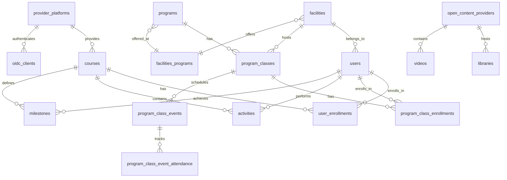

# Database Schema Documentation

This document provides comprehensive documentation for the UnlockEdv2 PostgreSQL database schema, including all tables, relationships, constraints, and migration patterns.

## 📋 Table of Contents
- [Schema Overview](#schema-overview)
- [Entity Relationship Diagram](#entity-relationship-diagram)
- [Core Entities](#core-entities)
- [Table Definitions](#table-definitions)
- [Relationships & Constraints](#relationships--constraints)
- [Indexes & Performance](#indexes--performance)
- [Migrations](#migrations)
- [Data Seeding](#data-seeding)

## 🏗️ Schema Overview

UnlockEdv2 uses a PostgreSQL database with a comprehensive schema designed for educational management in correctional facilities. The schema supports:

- **Multi-tenancy**: Facility-based data isolation
- **RBAC**: Role-based access control with 4-tier hierarchy
- **Audit Trails**: Comprehensive change tracking
- **LMS Integration**: External learning management system support
- **Content Management**: Open educational resources and libraries
- **Program Management**: Educational and vocational programs
- **Analytics**: Progress tracking and reporting

### Database Statistics
- **55+ Migration Files**: Incremental schema evolution
- **50+ Tables**: Comprehensive data model
- **100+ Relationships**: Foreign key constraints
- **50+ Indexes**: Optimized query performance
- **Soft Deletes**: Most tables support soft deletion
- **Audit Functions**: Automatic change logging

## 🔗 Entity Relationship Diagram



## 🎯 Core Entities

### User Management
- **users**: Core user accounts with facility association and role-based permissions
- **facilities**: Correctional facility organizations with timezone support  
- **user_roles**: System roles defining permission levels
- **user_account_history**: Comprehensive audit trail for user actions

### Program Management
- **programs**: Educational and vocational program definitions
- **program_types**: Program classifications (Educational, Vocational, etc.)
- **program_classes**: Specific class instances with scheduling and capacity
- **program_class_enrollments**: Student enrollment tracking with status management
- **program_class_events**: Scheduled class sessions with recurrence support
- **program_class_event_attendance**: Individual session attendance tracking

### Course Management (LMS)
- **courses**: External LMS course integration
- **provider_platforms**: LMS system configurations (Canvas, Kolibri, Brightspace)
- **user_enrollments**: Course enrollment tracking
- **activities**: Learning activity logging
- **milestones**: Progress milestone tracking
- **outcomes**: Achievement and completion records

### Content Management
- **open_content_providers**: Content source systems (YouTube, Kiwix)
- **libraries**: Educational library resources
- **videos**: Video content with metadata
- **helpful_links**: Curated educational resources
- **open_content_activities**: Content usage tracking

---

## 📊 Table Definitions

### User Management Tables

#### `users`
**Primary user account table with facility association**
```sql
CREATE TABLE users (
    id SERIAL PRIMARY KEY,
    username VARCHAR(255) UNIQUE NOT NULL,
    name_first VARCHAR(255) NOT NULL,
    name_last VARCHAR(255) NOT NULL,
    email VARCHAR(255) UNIQUE NOT NULL,
    role user_role NOT NULL DEFAULT 'student',
    kratos_id VARCHAR(255) UNIQUE,
    facility_id INTEGER NOT NULL REFERENCES facilities(id),
    doc_id VARCHAR(255), -- Document/resident ID
    deactivated_at TIMESTAMPTZ,
    created_at TIMESTAMPTZ DEFAULT NOW(),
    updated_at TIMESTAMPTZ DEFAULT NOW(),
    deleted_at TIMESTAMPTZ
);

-- Indexes
CREATE INDEX idx_users_facility_id ON users(facility_id);
CREATE INDEX idx_users_role ON users(role);
CREATE INDEX idx_users_kratos_id ON users(kratos_id);
CREATE INDEX idx_users_deactivated ON users(deactivated_at);
```

#### `facilities`
**Correctional facility organizations**
```sql
CREATE TABLE facilities (
    id SERIAL PRIMARY KEY,
    name VARCHAR(255) UNIQUE NOT NULL,
    timezone VARCHAR(100) NOT NULL DEFAULT 'UTC',
    created_at TIMESTAMPTZ DEFAULT NOW(),
    updated_at TIMESTAMPTZ DEFAULT NOW()
);
```

#### `user_account_history`
**Audit trail for user account changes**
```sql
CREATE TABLE user_account_history (
    user_id INTEGER NOT NULL REFERENCES users(id) ON DELETE CASCADE,
    admin_id INTEGER REFERENCES users(id) ON DELETE SET NULL,
    action activity_history_action NOT NULL,
    program_classes_history_id INTEGER,
    facility_id INTEGER REFERENCES facilities(id),
    created_at TIMESTAMPTZ NOT NULL DEFAULT NOW(),
    PRIMARY KEY (user_id, action, created_at)
);

-- Action types
CREATE TYPE activity_history_action AS ENUM (
    'account_creation',
    'facility_transfer', 
    'set_password',
    'reset_password',
    'progclass_history',
    'user_deactivated'
);
```

### Program Management Tables

#### `programs`
**Educational and vocational program definitions**
```sql
CREATE TABLE programs (
    id SERIAL PRIMARY KEY,
    name VARCHAR(255) UNIQUE NOT NULL,
    description TEXT,
    funding_type funding_type,
    is_active BOOLEAN DEFAULT true,
    archived_at TIMESTAMPTZ,
    create_user_id INTEGER REFERENCES users(id),
    update_user_id INTEGER REFERENCES users(id),
    created_at TIMESTAMPTZ DEFAULT NOW(),
    updated_at TIMESTAMPTZ DEFAULT NOW()
);

-- Funding types
CREATE TYPE funding_type AS ENUM (
    'Federal_Grants',
    'State_Grants', 
    'Nonprofit_Organizations',
    'Educational_Grants',
    'Inmate_Welfare_Funds',
    'Other'
);
```

#### `program_types`
**Program classification system**
```sql
CREATE TABLE program_types (
    program_type program_type NOT NULL,
    program_id INTEGER NOT NULL REFERENCES programs(id) ON DELETE CASCADE,
    PRIMARY KEY (program_type, program_id)
);

CREATE TYPE program_type AS ENUM (
    'Educational',
    'Vocational', 
    'Mental_Health_Behavioral',
    'Religious_Faith-Based',
    'Re-Entry',
    'Therapeutic',
    'Life_Skills'
);
```

#### `program_classes`
**Specific class instances with scheduling**
```sql
CREATE TABLE program_classes (
    id SERIAL PRIMARY KEY,
    program_id INTEGER NOT NULL REFERENCES programs(id),
    facility_id INTEGER NOT NULL REFERENCES facilities(id),
    capacity BIGINT,
    name VARCHAR(255) NOT NULL,
    instructor_name VARCHAR(255),
    description TEXT,
    archived_at TIMESTAMPTZ,
    start_dt TIMESTAMPTZ NOT NULL,
    end_dt TIMESTAMPTZ,
    status class_status DEFAULT 'Scheduled',
    credit_hours BIGINT,
    create_user_id INTEGER REFERENCES users(id),
    update_user_id INTEGER REFERENCES users(id),
    created_at TIMESTAMPTZ DEFAULT NOW(),
    updated_at TIMESTAMPTZ DEFAULT NOW()
);

CREATE TYPE class_status AS ENUM (
    'Scheduled',
    'Active', 
    'Cancelled',
    'Completed',
    'Paused'
);

-- Indexes
CREATE INDEX idx_program_classes_program_id ON program_classes(program_id);
CREATE INDEX idx_program_classes_facility_id ON program_classes(facility_id);
CREATE INDEX idx_program_classes_status ON program_classes(status);
```

#### `program_class_enrollments`
**Student enrollment tracking**
```sql
CREATE TABLE program_class_enrollments (
    id SERIAL PRIMARY KEY,
    class_id INTEGER NOT NULL REFERENCES program_classes(id),
    user_id INTEGER NOT NULL REFERENCES users(id),
    enrollment_status program_enrollment_status DEFAULT 'Enrolled',
    change_reason TEXT,
    enrolled_at TIMESTAMPTZ,
    enrollment_ended_at TIMESTAMPTZ,
    created_at TIMESTAMPTZ DEFAULT NOW(),
    updated_at TIMESTAMPTZ DEFAULT NOW(),
    UNIQUE(class_id, user_id)
);

CREATE TYPE program_enrollment_status AS ENUM (
    'Enrolled',
    'Cancelled',
    'Completed',
    'Incomplete: Withdrawn',
    'Incomplete: Dropped',
    'Incomplete: Failed to Complete',
    'Incomplete: Transfered',
    'Incomplete: Segregated'
);

-- Indexes  
CREATE INDEX idx_enrollments_class_id ON program_class_enrollments(class_id);
CREATE INDEX idx_enrollments_user_id ON program_class_enrollments(user_id);
CREATE INDEX idx_enrollments_status ON program_class_enrollments(enrollment_status);
```

#### `program_class_events`
**Scheduled class sessions with recurrence**
```sql
CREATE TABLE program_class_events (
    id SERIAL PRIMARY KEY,
    class_id INTEGER NOT NULL REFERENCES program_classes(id),
    duration VARCHAR(50), -- e.g., "1h30m"
    recurrence_rule TEXT, -- RFC 5545 RRULE format
    room VARCHAR(255),
    created_at TIMESTAMPTZ DEFAULT NOW(),
    updated_at TIMESTAMPTZ DEFAULT NOW()
);

CREATE INDEX idx_events_class_id ON program_class_events(class_id);
```

#### `program_class_event_attendance`
**Individual session attendance tracking**
```sql
CREATE TABLE program_class_event_attendance (
    id SERIAL PRIMARY KEY,
    event_id INTEGER NOT NULL REFERENCES program_class_events(id),
    user_id INTEGER NOT NULL REFERENCES users(id),
    date VARCHAR(50) NOT NULL, -- Event date
    attendance_status attendance DEFAULT 'absent_unexcused',
    note TEXT,
    created_at TIMESTAMPTZ DEFAULT NOW(),
    updated_at TIMESTAMPTZ DEFAULT NOW(),
    UNIQUE(event_id, user_id, date)
);

CREATE TYPE attendance AS ENUM (
    'present',
    'absent_excused',
    'absent_unexcused'
);

-- Indexes
CREATE INDEX idx_attendance_event_id ON program_class_event_attendance(event_id);
CREATE INDEX idx_attendance_user_id ON program_class_event_attendance(user_id);
CREATE INDEX idx_attendance_date ON program_class_event_attendance(date);
```

### Course Management Tables (LMS Integration)

#### `provider_platforms`
**External LMS system configurations**
```sql
CREATE TABLE provider_platforms (
    id SERIAL PRIMARY KEY,
    type provider_platform_type NOT NULL,
    name VARCHAR(255) NOT NULL,
    account_id VARCHAR(255),
    access_key TEXT, -- Encrypted API credentials
    base_url VARCHAR(500),
    state provider_platform_state DEFAULT 'enabled',
    external_auth_provider_id VARCHAR(255),
    oidc_id INTEGER,
    created_at TIMESTAMPTZ DEFAULT NOW(),
    updated_at TIMESTAMPTZ DEFAULT NOW()
);

CREATE TYPE provider_platform_type AS ENUM (
    'canvas_oss',
    'canvas_cloud',
    'kolibri', 
    'brightspace'
);

CREATE TYPE provider_platform_state AS ENUM (
    'enabled',
    'disabled',
    'archived'
);
```

#### `courses`
**LMS course integration**
```sql
CREATE TABLE courses (
    id SERIAL PRIMARY KEY,
    provider_platform_id INTEGER NOT NULL REFERENCES provider_platforms(id),
    name VARCHAR(500) NOT NULL,
    description TEXT,
    external_id VARCHAR(255) NOT NULL, -- LMS course ID
    thumbnail_url VARCHAR(500),
    type course_type DEFAULT 'open_enrollment',
    outcome_types VARCHAR(500), -- JSON array
    external_url VARCHAR(500),
    alt_name VARCHAR(500),
    total_progress_milestones INTEGER DEFAULT 0,
    start_dt TIMESTAMPTZ,
    end_dt TIMESTAMPTZ,
    created_at TIMESTAMPTZ DEFAULT NOW(),
    updated_at TIMESTAMPTZ DEFAULT NOW(),
    deleted_at TIMESTAMPTZ,
    UNIQUE(provider_platform_id, external_id)
);

CREATE TYPE course_type AS ENUM (
    'open_enrollment',
    'open_content',
    'fixed_enrollment'
);

-- Indexes
CREATE INDEX idx_courses_provider_id ON courses(provider_platform_id);
CREATE INDEX idx_courses_external_id ON courses(external_id);
CREATE INDEX idx_courses_type ON courses(type);
```

#### `user_enrollments`
**Course enrollment tracking**
```sql
CREATE TABLE user_enrollments (
    user_id INTEGER NOT NULL REFERENCES users(id) ON DELETE CASCADE,
    course_id INTEGER NOT NULL REFERENCES courses(id) ON DELETE CASCADE,
    external_id VARCHAR(255),
    created_at TIMESTAMPTZ,
    updated_at TIMESTAMPTZ,
    deleted_at TIMESTAMPTZ,
    PRIMARY KEY (user_id, course_id)
);

CREATE INDEX idx_user_enrollments_user_id ON user_enrollments(user_id);
CREATE INDEX idx_user_enrollments_course_id ON user_enrollments(course_id);
```

#### `activities`
**Learning activity tracking**
```sql
CREATE TABLE activities (
    id SERIAL PRIMARY KEY,
    course_id INTEGER NOT NULL REFERENCES courses(id),
    user_id INTEGER NOT NULL REFERENCES users(id),
    type activity_type DEFAULT 'interaction',
    total_time BIGINT DEFAULT 0,
    time_delta BIGINT DEFAULT 0,
    external_id VARCHAR(255), -- External content identifier
    created_at TIMESTAMPTZ DEFAULT NOW(),
    updated_at TIMESTAMPTZ DEFAULT NOW()
);

CREATE TYPE activity_type AS ENUM (
    'interaction',
    'completion'
);

-- Indexes
CREATE INDEX idx_activities_course_user ON activities(course_id, user_id);
CREATE INDEX idx_activities_created_at ON activities(created_at);
```

#### `milestones`
**Progress milestone tracking**
```sql
CREATE TABLE milestones (
    id SERIAL PRIMARY KEY,
    user_id INTEGER NOT NULL REFERENCES users(id),
    course_id INTEGER NOT NULL REFERENCES courses(id),
    external_id VARCHAR(255) NOT NULL,
    type milestone_type DEFAULT 'enrollment',
    is_completed BOOLEAN DEFAULT false,
    created_at TIMESTAMPTZ DEFAULT NOW(),
    updated_at TIMESTAMPTZ DEFAULT NOW(),
    UNIQUE(user_id, course_id, external_id)
);

CREATE TYPE milestone_type AS ENUM (
    'enrollment',
    'quiz_submission',
    'assignment_submission',
    'grade_received', 
    'discussion_post'
);

-- Indexes
CREATE INDEX idx_milestones_user_course ON milestones(user_id, course_id);
CREATE INDEX idx_milestones_type ON milestones(type);
```

#### `outcomes`
**Achievement and completion records**
```sql
CREATE TABLE outcomes (
    id SERIAL PRIMARY KEY,
    type outcome_type NOT NULL,
    course_id INTEGER NOT NULL REFERENCES courses(id),
    user_id INTEGER NOT NULL REFERENCES users(id),
    value TEXT,
    created_at TIMESTAMPTZ DEFAULT NOW(),
    updated_at TIMESTAMPTZ DEFAULT NOW()
);

CREATE TYPE outcome_type AS ENUM (
    'certificate',
    'grade',
    'progress_completion',
    'pathway_completion',
    'college_credit'
);

-- Indexes
CREATE INDEX idx_outcomes_user_course ON outcomes(user_id, course_id);
CREATE INDEX idx_outcomes_type ON outcomes(type);
```

### Content Management Tables

#### `open_content_providers`
**Content source systems**
```sql
CREATE TABLE open_content_providers (
    id SERIAL PRIMARY KEY,
    title VARCHAR(255) NOT NULL,
    url VARCHAR(500),
    thumbnail_url VARCHAR(500),
    currently_enabled BOOLEAN DEFAULT true,
    description TEXT,
    created_at TIMESTAMPTZ DEFAULT NOW(),
    updated_at TIMESTAMPTZ DEFAULT NOW()
);
```

#### `libraries`
**Educational library resources**
```sql
CREATE TABLE libraries (
    id SERIAL PRIMARY KEY,
    open_content_provider_id INTEGER NOT NULL REFERENCES open_content_providers(id),
    external_id VARCHAR(255),
    title VARCHAR(500) NOT NULL,
    language VARCHAR(255),
    description TEXT,
    url VARCHAR(500) NOT NULL,
    thumbnail_url VARCHAR(500),
    visibility_status BOOLEAN DEFAULT true,
    created_at TIMESTAMPTZ DEFAULT NOW(),
    updated_at TIMESTAMPTZ DEFAULT NOW()
);

CREATE INDEX idx_libraries_provider_id ON libraries(open_content_provider_id);
```

#### `videos`
**Video content with metadata**
```sql
CREATE TABLE videos (
    id SERIAL PRIMARY KEY,
    external_id VARCHAR(255) UNIQUE NOT NULL,
    url VARCHAR(500) UNIQUE NOT NULL,
    title VARCHAR(500) NOT NULL,
    availability video_availability DEFAULT 'processing',
    channel_title VARCHAR(255),
    duration INTEGER, -- seconds
    description TEXT,
    thumbnail_url VARCHAR(500),
    open_content_provider_id INTEGER NOT NULL REFERENCES open_content_providers(id),
    visibility_status BOOLEAN DEFAULT true,
    created_at TIMESTAMPTZ DEFAULT NOW(),
    updated_at TIMESTAMPTZ DEFAULT NOW()
);

CREATE TYPE video_availability AS ENUM (
    'available',
    'processing', 
    'has_error'
);

CREATE INDEX idx_videos_provider_id ON videos(open_content_provider_id);
CREATE INDEX idx_videos_availability ON videos(availability);
```

### System Tables

#### `feature_flags`
**System-wide feature toggles**
```sql
CREATE TABLE feature_flags (
    id SERIAL PRIMARY KEY,
    name feature_access UNIQUE NOT NULL,
    enabled BOOLEAN DEFAULT false,
    created_at TIMESTAMPTZ DEFAULT NOW(),
    updated_at TIMESTAMPTZ DEFAULT NOW()
);

CREATE TYPE feature_access AS ENUM (
    'open_content',
    'provider_platforms',
    'program_management'
);
```

#### `cron_jobs`
**Scheduled background task definitions**
```sql
CREATE TABLE cron_jobs (
    id VARCHAR(255) PRIMARY KEY, -- UUID
    name VARCHAR(255) NOT NULL,
    schedule VARCHAR(100) DEFAULT '0 2 * * *', -- Daily at 2 AM
    category INTEGER NOT NULL -- 1=ProviderPlatform, 2=OpenContent, 3=ProgramManagement
);
```

#### `runnable_tasks`
**Background task execution tracking**
```sql
CREATE TABLE runnable_tasks (
    id SERIAL PRIMARY KEY,
    job_id VARCHAR(255) NOT NULL REFERENCES cron_jobs(id),
    last_run TIMESTAMPTZ DEFAULT NOW(),
    provider_platform_id INTEGER REFERENCES provider_platforms(id),
    open_content_provider_id INTEGER REFERENCES open_content_providers(id),
    status job_status DEFAULT 'pending',
    created_at TIMESTAMPTZ DEFAULT NOW(),
    updated_at TIMESTAMPTZ DEFAULT NOW()
);

CREATE TYPE job_status AS ENUM (
    'pending',
    'running'
);
```

---

## 🔗 Relationships & Constraints

### Primary Foreign Key Relationships

#### User-Facility Hierarchy
```sql
-- Users belong to facilities (Many-to-One)
users.facility_id → facilities.id (NOT NULL, ON DELETE RESTRICT)

-- Programs are offered at facilities (Many-to-Many through junction table)
facilities_programs.facility_id → facilities.id (ON DELETE CASCADE)
facilities_programs.program_id → programs.id (ON DELETE CASCADE)
```

#### Program Structure
```sql
-- Classes belong to programs and facilities
program_classes.program_id → programs.id (NOT NULL, ON DELETE CASCADE)
program_classes.facility_id → facilities.id (NOT NULL, ON DELETE RESTRICT)

-- Enrollments link users to classes
program_class_enrollments.user_id → users.id (NOT NULL, ON DELETE CASCADE)
program_class_enrollments.class_id → program_classes.id (NOT NULL, ON DELETE CASCADE)

-- Events belong to classes
program_class_events.class_id → program_classes.id (NOT NULL, ON DELETE CASCADE)

-- Attendance links users to events
program_class_event_attendance.user_id → users.id (NOT NULL, ON DELETE CASCADE)
program_class_event_attendance.event_id → program_class_events.id (NOT NULL, ON DELETE CASCADE)
```

#### LMS Integration
```sql  
-- Courses belong to provider platforms
courses.provider_platform_id → provider_platforms.id (NOT NULL, ON DELETE CASCADE)

-- User enrollments in courses  
user_enrollments.user_id → users.id (NOT NULL, ON DELETE CASCADE)
user_enrollments.course_id → courses.id (NOT NULL, ON DELETE CASCADE)

-- Learning activities
activities.user_id → users.id (NOT NULL, ON DELETE CASCADE)
activities.course_id → courses.id (NOT NULL, ON DELETE CASCADE)

-- Progress milestones
milestones.user_id → users.id (NOT NULL, ON DELETE CASCADE)
milestones.course_id → courses.id (NOT NULL, ON DELETE CASCADE)
```

### Unique Constraints

#### Business Rule Enforcement
```sql
-- One enrollment per user per class
UNIQUE(user_id, class_id) ON program_class_enrollments

-- One enrollment per user per course
PRIMARY KEY(user_id, course_id) ON user_enrollments

-- One attendance record per user per event per date
UNIQUE(event_id, user_id, date) ON program_class_event_attendance

-- One milestone per user per course per external ID
UNIQUE(user_id, course_id, external_id) ON milestones

-- Unique external course identifiers per provider
UNIQUE(provider_platform_id, external_id) ON courses
```

#### System Constraints
```sql
-- Unique usernames and emails
UNIQUE(username) ON users
UNIQUE(email) ON users
UNIQUE(kratos_id) ON users

-- Unique facility names
UNIQUE(name) ON facilities

-- Unique program names
UNIQUE(name) ON programs

-- Unique video external IDs and URLs
UNIQUE(external_id) ON videos
UNIQUE(url) ON videos
```

### Cascade Rules

#### Data Integrity
```sql
-- User deletion cascades to related records
users → user_enrollments (CASCADE)
users → program_class_enrollments (CASCADE)
users → activities (CASCADE)
users → milestones (CASCADE)
users → outcomes (CASCADE)
users → user_account_history (CASCADE)

-- Program deletion cascades to classes and enrollments
programs → program_classes (CASCADE)
program_classes → program_class_enrollments (CASCADE)
program_classes → program_class_events (CASCADE)

-- Provider platform deletion cascades to courses and related data
provider_platforms → courses (CASCADE)
courses → user_enrollments (CASCADE)
courses → activities (CASCADE)
courses → milestones (CASCADE)
courses → outcomes (CASCADE)
```

#### Reference Preservation
```sql
-- Preserve references when admins are deleted
user_account_history.admin_id → users.id (SET NULL)

-- Restrict facility deletion if users exist
users.facility_id → facilities.id (RESTRICT)
program_classes.facility_id → facilities.id (RESTRICT)
```

---

## 📈 Indexes & Performance

### Facility-Based Queries (Multi-tenancy)
```sql
-- Primary facility isolation indexes
CREATE INDEX idx_users_facility_id ON users(facility_id);
CREATE INDEX idx_program_classes_facility_id ON program_classes(facility_id);
CREATE INDEX idx_helpful_links_facility_id ON helpful_links(facility_id);

-- Composite indexes for facility-scoped queries
CREATE INDEX idx_enrollments_facility_user ON program_class_enrollments(facility_id, user_id);
CREATE INDEX idx_activities_facility_user ON activities(facility_id, user_id);
```

### Time-Based Queries
```sql
-- Activity and audit trail queries
CREATE INDEX idx_activities_created_at ON activities(created_at);
CREATE INDEX idx_user_sessions_start_ts ON user_session_tracking(session_start_ts);
CREATE INDEX idx_change_log_created_at ON change_log_entries(created_at);

-- Attendance and scheduling
CREATE INDEX idx_attendance_date ON program_class_event_attendance(date);
CREATE INDEX idx_classes_start_dt ON program_classes(start_dt);
```

### Authentication & Security
```sql
-- External system integration
CREATE INDEX idx_users_kratos_id ON users(kratos_id);
CREATE INDEX idx_courses_external_id ON courses(external_id);
CREATE INDEX idx_provider_mappings_external_user ON provider_user_mappings(external_user_id);

-- Session and security tracking
CREATE INDEX idx_failed_logins_user_id ON failed_login_attempts(user_id);
CREATE INDEX idx_login_metrics_last_login ON login_metrics(last_login);
```

### Audit Trail Queries
```sql
-- Change tracking and history
CREATE INDEX idx_change_log_table_ref ON change_log_entries(name_table, parent_ref_id);
CREATE INDEX idx_program_history_parent_ref ON program_classes_history(parent_ref_id);
CREATE INDEX idx_account_history_user_action ON user_account_history(user_id, action);
```

### Content and Search
```sql
-- Content visibility and access
CREATE INDEX idx_libraries_visibility ON libraries(visibility_status);
CREATE INDEX idx_videos_availability ON videos(availability);
CREATE INDEX idx_content_activities_user ON open_content_activities(user_id);

-- Text search support
CREATE INDEX idx_programs_name ON programs USING gin(to_tsvector('english', name));
CREATE INDEX idx_courses_name ON courses USING gin(to_tsvector('english', name));
```

### Performance Optimization

#### Query Optimization Patterns
```sql
-- Composite indexes for common query patterns
CREATE INDEX idx_enrollments_status_class ON program_class_enrollments(enrollment_status, class_id);
CREATE INDEX idx_milestones_completed_user ON milestones(is_completed, user_id);
CREATE INDEX idx_outcomes_type_user ON outcomes(type, user_id);

-- Covering indexes for frequent SELECT queries
CREATE INDEX idx_users_facility_role_covering ON users(facility_id, role) INCLUDE (username, name_first, name_last);
```

#### Database Maintenance
```sql
-- Regular maintenance tasks
VACUUM ANALYZE; -- Weekly
REINDEX DATABASE unlocked_production; -- Monthly

-- Statistics for query planner
ANALYZE users;
ANALYZE program_class_enrollments; 
ANALYZE activities;
```

---

## 🔄 Migrations

### Migration System Overview
UnlockEdv2 uses a sequential migration system with 55+ migration files providing incremental schema evolution with rollback support.

#### Migration Naming Convention
```
NNNNN_descriptive_name.sql
```
Examples:
- `00001_create_functions.sql` - Initial database functions
- `00002_create_init_tables.sql` - Core table creation
- `00055_add_timestamps_program_classes.sql` - Latest schema updates

### Key Migration Categories

#### Initial Setup (001-010)
```sql
-- 00001_create_functions.sql
-- Database utility functions and triggers

-- 00002_create_init_tables.sql  
-- Core tables: users, facilities, user_roles

-- 00003_add_programs_tables.sql
-- Program management tables

-- 00005_add_unique_constraint_on_events_attendance.sql
-- Business rule enforcement
```

#### Feature Additions (011-030)
```sql
-- 00015_add_facilities_programs_relationship.sql
-- Many-to-many program-facility association

-- 00018_add_feature_flags_table.sql
-- System feature toggle support

-- 00021_add_open_content_activity_tables.sql
-- Content usage tracking

-- 00025_add_login_count_table.sql
-- Authentication metrics
```

#### Schema Evolution (031-055)
```sql
-- 00036_add_facility_visibility_statuses.sql
-- Per-facility content visibility

-- 00043_update_program_completions.sql
-- Enhanced completion tracking

-- 00050_add_failed_login_attempts_table.sql
-- Security enhancement

-- 00055_add_timestamps_program_classes.sql
-- Audit trail improvements
```

### Migration Execution

#### Development Environment
```bash
# Run all pending migrations
make migrate

# Fresh migration (drops all data)
make migrate-fresh

# Check migration status
docker exec unlockedv2-server-1 ./migrate -path ./migrations -database $DATABASE_URL version
```

#### Production Environment
```bash
# Backup database before migration
pg_dump $DATABASE_URL > backup_$(date +%Y%m%d_%H%M%S).sql

# Run migrations with verification
./migrate -path ./migrations -database $DATABASE_URL up

# Verify schema integrity
psql $DATABASE_URL -c "SELECT COUNT(*) FROM schema_migrations;"
```

### Migration Best Practices

#### Safe Migration Patterns
```sql
-- Add columns with defaults (safe)
ALTER TABLE users ADD COLUMN middle_name VARCHAR(255);

-- Add indexes concurrently (safe for production)
CREATE INDEX CONCURRENTLY idx_users_middle_name ON users(middle_name);

-- Add constraints with validation (safe)
ALTER TABLE users ADD CONSTRAINT valid_email CHECK (email ~* '^[A-Za-z0-9._%-]+@[A-Za-z0-9.-]+[.][A-Za-z]+$');
```

#### Rollback Considerations
```sql
-- Reversible changes
ALTER TABLE users DROP COLUMN middle_name; -- Can be rolled back if no data loss

-- Non-reversible changes (require careful planning)
ALTER TABLE users DROP COLUMN sensitive_data; -- Data loss - backup required
```

---

## 🌱 Data Seeding

### Seed Data Categories

#### System Configuration
```sql
-- Feature flags
INSERT INTO feature_flags (name, enabled) VALUES
    ('open_content', true),
    ('provider_platforms', true),
    ('program_management', true);

-- User roles
INSERT INTO user_roles (name) VALUES
    ('student'),
    ('facility_admin'), 
    ('department_admin'),
    ('system_admin');
```

#### Test Facilities and Users
```sql
-- Development facilities
INSERT INTO facilities (name, timezone) VALUES
    ('Central Correctional Facility', 'America/New_York'),
    ('Western State Prison', 'America/Los_Angeles'),
    ('Northern Regional Center', 'America/Chicago');

-- Administrative users
INSERT INTO users (username, name_first, name_last, email, role, facility_id) VALUES
    ('SuperAdmin', 'System', 'Administrator', 'admin@unlocked.example', 'system_admin', 1),
    ('facility_admin_1', 'John', 'Smith', 'john.smith@facility1.example', 'facility_admin', 1);
```

#### Sample Programs
```sql
-- Educational programs
INSERT INTO programs (name, description, funding_type, is_active) VALUES
    ('Adult Basic Education', 'Literacy and numeracy education', 'Federal_Grants', true),
    ('GED Preparation', 'High school equivalency preparation', 'State_Grants', true),
    ('Computer Skills', 'Basic computer literacy training', 'Educational_Grants', true);
```

#### Content Providers
```sql  
-- Open content sources
INSERT INTO open_content_providers (title, url, currently_enabled, description) VALUES
    ('YouTube', 'https://youtube.com', true, 'Educational video content'),
    ('Kiwix', 'http://kiwix:3000', true, 'Offline educational libraries'),
    ('Khan Academy', 'https://khanacademy.org', true, 'Free online education');
```

### Seeding Commands

#### Development Setup
```bash
# Run seed data (after migrations)
make seed

# Custom seed for testing
docker exec -it unlockedv2-server-1 go run seeder/main.go
```

#### Production Considerations
```sql
-- Minimal production seed (only essential system data)
INSERT INTO feature_flags (name, enabled) VALUES
    ('open_content', false),        -- Enable after configuration
    ('provider_platforms', false),  -- Enable after LMS setup
    ('program_management', true);   -- Core functionality

-- Create initial admin user (change password immediately)
INSERT INTO users (username, name_first, name_last, email, role, facility_id) VALUES
    ('initial_admin', 'Initial', 'Admin', 'admin@yourdomain.com', 'system_admin', 1);
```

---

## 🔧 Database Maintenance

### Regular Maintenance Tasks

#### Performance Monitoring
```sql
-- Query performance analysis
SELECT query, mean_exec_time, calls, total_exec_time 
FROM pg_stat_statements 
ORDER BY total_exec_time DESC 
LIMIT 10;

-- Index usage statistics  
SELECT schemaname, tablename, indexname, idx_scan, idx_tup_read, idx_tup_fetch
FROM pg_stat_user_indexes
ORDER BY idx_scan DESC;

-- Table size analysis
SELECT schemaname, tablename, 
       pg_size_pretty(pg_total_relation_size(schemaname||'.'||tablename)) as size
FROM pg_tables 
WHERE schemaname = 'public'
ORDER BY pg_total_relation_size(schemaname||'.'||tablename) DESC;
```

#### Backup Strategy
```bash
# Daily backup with rotation
pg_dump $DATABASE_URL | gzip > backup_$(date +%Y%m%d).sql.gz

# Point-in-time recovery setup
# Enable WAL archiving in postgresql.conf
archive_mode = on
archive_command = 'cp %p /backup/wal/%f'

# Weekly full backup
pg_basebackup -D /backup/base_$(date +%Y%m%d) -Ft -z
```

#### Cleanup Operations
```sql
-- Clean up soft-deleted records (older than 1 year)
DELETE FROM users WHERE deleted_at < NOW() - INTERVAL '1 year';
DELETE FROM courses WHERE deleted_at < NOW() - INTERVAL '1 year';

-- Archive old activity records (older than 2 years)  
INSERT INTO activities_archive SELECT * FROM activities 
WHERE created_at < NOW() - INTERVAL '2 years';

DELETE FROM activities WHERE created_at < NOW() - INTERVAL '2 years';

-- Update table statistics
ANALYZE;
```

### Connection Management
```sql
-- Monitor active connections
SELECT datname, usename, application_name, client_addr, state, query_start
FROM pg_stat_activity
WHERE state != 'idle'
ORDER BY query_start;

-- Connection pooling configuration (PgBouncer)
pool_mode = transaction
default_pool_size = 25
max_client_conn = 100
```

This comprehensive database documentation provides developers with everything needed to understand, maintain, and extend the UnlockEdv2 database schema effectively.