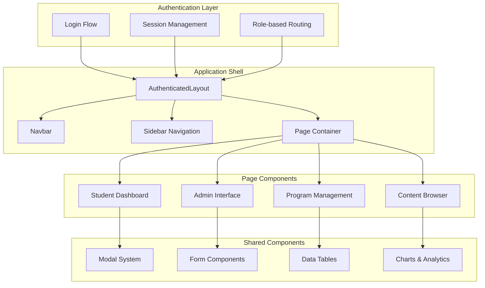

# Frontend Architecture Documentation

This document provides comprehensive documentation for the UnlockEdv2 React frontend application, including architecture patterns, component organization, state management, and development guidelines.

## 📋 Table of Contents
- [Architecture Overview](#architecture-overview)
- [Technology Stack](#technology-stack)
- [Project Structure](#project-structure)
- [Component Architecture](#component-architecture)
- [State Management](#state-management)
- [Routing System](#routing-system)
- [Authentication Integration](#authentication-integration)
- [API Integration](#api-integration)
- [UI/UX Design System](#uiux-design-system)
- [Performance Optimization](#performance-optimization)
- [Testing Strategy](#testing-strategy)
- [Build & Development](#build--development)
- [Best Practices](#best-practices)

## 🏗️ Architecture Overview

The UnlockEdv2 frontend is a modern React application built with TypeScript, designed for correctional facility educational management with role-based interfaces and responsive design.

### Key Architectural Principles
- **Component-Based Architecture**: Reusable, composable UI components
- **Responsive Design**: Mobile-first approach with Tailwind CSS
- **Type Safety**: Comprehensive TypeScript integration
- **Performance First**: Optimized bundle sizes and lazy loading
- **Accessibility**: WCAG 2.1 AA compliance
- **Multi-tenancy**: Facility-aware UI components

### Application Flow


---

## 🛠️ Technology Stack

### Core Technologies
```json
{
  "react": "^18.2.0",              // UI library with concurrent features
  "react-dom": "^18.2.0",         // DOM rendering
  "typescript": "^5.6.3",         // Type safety and developer experience
  "vite": "^5.2.0"                // Fast build tool and dev server
}
```

### UI & Styling
```json
{
  "tailwindcss": "^3.4.3",        // Utility-first CSS framework
  "daisyui": "^4.10.5",           // Pre-built component library
  "autoprefixer": "^10.4.19",     // CSS vendor prefixing
  "postcss": "^8.4.38"            // CSS processing
}
```

### State & Data Management
```json
{
  "swr": "^2.2.5",                // Data fetching and caching
  "react-hook-form": "^7.51.3",   // Form state management
  "usehooks-ts": "^3.1.0"         // Custom React hooks collection
}
```

### Routing & Navigation
```json
{
  "react-router-dom": "^6.23.0"   // Client-side routing
}
```

### Date & Time Management
```json
{
  "date-fns": "^4.1.0",           // Date manipulation utilities
  "date-fns-tz": "^3.2.0",        // Timezone support
  "moment": "^2.30.1"             // Legacy date handling (being phased out)
}
```

### UI Components & Interactions
```json
{
  "react-big-calendar": "^1.18.0", // Calendar component for scheduling
  "react-calendar": "^5.0.0",      // Date picker component
  "react-select": "^5.10.1",       // Enhanced select components
  "recharts": "^2.12.7",           // Chart and analytics components
  "react-joyride": "^2.9.3",       // User onboarding tours
  "rrule": "^2.8.1"                // Recurrence rule processing
}
```

### Development Tools
```json
{
  "eslint": "^9.12.0",             // Code linting
  "prettier": "^3.2.5",            // Code formatting
  "@vitejs/plugin-react": "^4.2.1", // React plugin for Vite
  "husky": "^9.1.6"                // Git hooks
}
```

---

## 📁 Project Structure

### Directory Organization
```
frontend/
├── public/                      # Static assets
│   ├── fonts/                   # Inter and Lexend font files
│   ├── thumbnails/             # Content thumbnails
│   └── videos/                 # Local video storage
├── src/
│   ├── app.tsx                 # Main application component
│   ├── main.tsx               # Application entry point
│   ├── vite-env.d.ts          # Vite type definitions
│   │
│   ├── Components/            # Reusable UI components
│   │   ├── cards/            # Card-based display components
│   │   ├── dashboard/        # Dashboard-specific components
│   │   ├── forms/           # Form-related components
│   │   ├── helperFunctions/ # Utility functions
│   │   ├── inputs/          # Input controls and form elements
│   │   ├── modals/          # Modal dialog components
│   │   └── pill-labels/     # Status and filter pills
│   │
│   ├── Context/              # React context providers
│   │   ├── AuthContext.tsx  # Authentication state
│   │   ├── ThemeContext.tsx # Theme management
│   │   ├── ToastCtx.tsx     # Notification system
│   │   └── TourContext.tsx  # User onboarding
│   │
│   ├── Hooks/               # Custom React hooks
│   │   ├── paginationUrlSync.tsx
│   │   ├── sessionView.tsx
│   │   └── useCheckResponse.tsx
│   │
│   ├── Layouts/             # Page layout components
│   │   ├── AuthenticatedLayout.tsx
│   │   └── GuestLayout.tsx
│   │
│   ├── Pages/               # Route components
│   │   ├── Auth/           # Authentication pages
│   │   │   ├── Login.tsx
│   │   │   ├── ResetPassword.tsx
│   │   │   └── Consent.tsx
│   │   ├── Student/        # Student interface pages
│   │   ├── Admin/          # Administrative pages
│   │   └── ...             # Other page categories
│   │
│   ├── routeLoaders.ts     # Route data loading
│   ├── common.ts           # Shared utilities and types
│   ├── session_ws.ts       # WebSocket session handling
│   └── useAuth.ts          # Authentication hook
├── 
├── package.json            # Dependencies and scripts
├── tailwind.config.cjs     # Tailwind CSS configuration
├── tsconfig.json           # TypeScript configuration
├── vite.config.ts          # Vite build configuration
└── yarn.lock              # Dependency lock file
```

### Component Categories

#### Core Components (Root Level)
```typescript
// Essential application components
ApplicationLogo.tsx          // Branding component
Brand.tsx                   // Brand identity
Loading.tsx                 // Loading states
Modal.tsx                   // Base modal component
Navbar.tsx                  // Main navigation
PageNav.tsx                 // Page-level navigation
TitleManager.tsx            // Dynamic page titles
Toast.tsx                   // Notification component
```

#### Form Components (`inputs/`)
```typescript
// Form input controls
TextInput.tsx               // Standard text inputs
TextAreaInput.tsx           // Multi-line text inputs
NumberInput.tsx             // Numeric inputs
DateInput.tsx               // Date/time selection
TimeInput.tsx               // Time-specific inputs
DropdownInput.tsx           // Select dropdowns
MultiSelectInput.tsx        // Multiple selection
CheckboxInput.tsx           // Checkbox controls
DragDropFileInput.tsx       // File upload with drag-drop
SearchBar.tsx               // Search functionality
LibrarySearchBar.tsx        // Content-specific search
```

#### Modal Components (`modals/`)
```typescript
// Specialized modal dialogs
AddUserModal.tsx            // User creation
EditUserModal.tsx           // User editing
DeactivateUserModal.tsx     // User deactivation
AddFacilityModal.tsx        // Facility management
ModifyProgramModal.tsx      // Program editing
RegisterOIDCClientModal.tsx // OAuth client setup
UploadCompleteModal.tsx     // File upload status
```

#### Data Display (`cards/`)
```typescript
// Content display components
ActivityHistoryRowCard.tsx  // User activity history
HelpfulLinkCard.tsx         // Educational links
OpenContentCard.tsx         // Open educational content
LibrarySearchResultCard.tsx // Search results display
```

---

## 🧩 Component Architecture

### Component Design Patterns

#### Functional Components with Hooks
```typescript
// Modern React functional component pattern
import React, { useState, useEffect } from 'react';
import { User } from '../types';

interface UserProfileProps {
  userId: number;
  onUserUpdate?: (user: User) => void;
}

export default function UserProfile({ userId, onUserUpdate }: UserProfileProps) {
  const [user, setUser] = useState<User | null>(null);
  const [loading, setLoading] = useState(true);
  const [error, setError] = useState<string | null>(null);

  useEffect(() => {
    fetchUserData(userId)
      .then(setUser)
      .catch(err => setError(err.message))
      .finally(() => setLoading(false));
  }, [userId]);

  const handleUpdate = async (updates: Partial<User>) => {
    try {
      const updatedUser = await updateUser(userId, updates);
      setUser(updatedUser);
      onUserUpdate?.(updatedUser);
    } catch (err) {
      setError(err.message);
    }
  };

  if (loading) return <Loading />;
  if (error) return <ErrorMessage error={error} />;
  if (!user) return <NotFound />;

  return (
    <div className="user-profile">
      <h1 className="text-2xl font-bold">{user.name}</h1>
      <UserForm user={user} onSubmit={handleUpdate} />
    </div>
  );
}
```

#### Compound Component Pattern
```typescript
// Modal system with compound components
export const Modal = {
  Root: ModalRoot,
  Header: ModalHeader,
  Body: ModalBody,
  Footer: ModalFooter,
  CloseButton: CloseButton
};

// Usage
<Modal.Root isOpen={isOpen} onClose={onClose}>
  <Modal.Header>
    <h2>Edit User</h2>
    <Modal.CloseButton />
  </Modal.Header>
  <Modal.Body>
    <UserForm user={selectedUser} />
  </Modal.Body>
  <Modal.Footer>
    <button onClick={handleSave}>Save</button>
    <button onClick={onClose}>Cancel</button>
  </Modal.Footer>
</Modal.Root>
```

#### Higher-Order Component for Authentication
```typescript
// Authentication HOC pattern
export function withAdminAccess<P extends {}>(
  Component: React.ComponentType<P>
) {
  return function AdminProtected(props: P) {
    const { user, loading } = useAuth();
    
    if (loading) return <Loading />;
    
    if (!user?.isAdmin()) {
      return <Unauthorized message="Admin access required" />;
    }
    
    return <Component {...props} />;
  };
}

// Usage
const AdminDashboard = withAdminAccess(Dashboard);
```

### Component Props Patterns

#### Base Component Props
```typescript
// Standard component prop interfaces
interface BaseComponentProps {
  className?: string;
  children?: React.ReactNode;
  testId?: string;
}

interface DataComponentProps<T> extends BaseComponentProps {
  data: T[];
  loading?: boolean;
  error?: string | null;
  emptyState?: React.ReactNode;
}

interface FormComponentProps<T> extends BaseComponentProps {
  initialValues?: Partial<T>;
  onSubmit: (values: T) => void | Promise<void>;
  validationSchema?: ValidationSchema<T>;
  disabled?: boolean;
}
```

#### Event Handler Props
```typescript
// Standardized event handler patterns
interface UserActionProps {
  onEdit?: (user: User) => void;
  onDelete?: (userId: number) => void;
  onDeactivate?: (userId: number) => void;
  onTransfer?: (userId: number, facilityId: number) => void;
}

interface PaginationProps {
  currentPage: number;
  totalPages: number;
  onPageChange: (page: number) => void;
  pageSize?: number;
  onPageSizeChange?: (size: number) => void;
}
```

---

## 🔄 State Management

### Context-Based Global State

#### Authentication Context
```typescript
// AuthContext.tsx - Central authentication state
interface AuthContextType {
  user: User | null;
  loading: boolean;
  error: string | null;
  login: (credentials: LoginCredentials) => Promise<void>;
  logout: () => Promise<void>;
  updateUser: (updates: Partial<User>) => void;
  hasPermission: (permission: Permission) => boolean;
  canAccessFacility: (facilityId: number) => boolean;
}

export const AuthContext = React.createContext<AuthContextType | null>(null);

export function AuthProvider({ children }: { children: React.ReactNode }) {
  const [user, setUser] = useState<User | null>(null);
  const [loading, setLoading] = useState(true);
  const [error, setError] = useState<string | null>(null);

  // Authentication logic
  const login = async (credentials: LoginCredentials) => {
    setLoading(true);
    try {
      const response = await authAPI.login(credentials);
      setUser(response.user);
      setError(null);
    } catch (err) {
      setError(err.message);
      throw err;
    } finally {
      setLoading(false);
    }
  };

  // Permission checking
  const hasPermission = (permission: Permission): boolean => {
    if (!user) return false;
    return user.permissions.includes(permission);
  };

  return (
    <AuthContext.Provider value={{
      user, loading, error,
      login, logout, updateUser,
      hasPermission, canAccessFacility
    }}>
      {children}
    </AuthContext.Provider>
  );
}

// Custom hook for authentication
export function useAuth() {
  const context = useContext(AuthContext);
  if (!context) {
    throw new Error('useAuth must be used within AuthProvider');
  }
  return context;
}
```

#### Theme Context
```typescript
// ThemeContext.tsx - Theme management
interface ThemeContextType {
  theme: 'light' | 'dark';
  toggleTheme: () => void;
  setTheme: (theme: 'light' | 'dark') => void;
}

export function ThemeProvider({ children }: { children: React.ReactNode }) {
  const [theme, setTheme] = useState<'light' | 'dark'>(() => {
    const saved = localStorage.getItem('theme');
    return (saved as 'light' | 'dark') || 'light';
  });

  useEffect(() => {
    document.documentElement.setAttribute('data-theme', theme);
    localStorage.setItem('theme', theme);
  }, [theme]);

  const toggleTheme = () => {
    setTheme(prev => prev === 'light' ? 'dark' : 'light');
  };

  return (
    <ThemeContext.Provider value={{ theme, toggleTheme, setTheme }}>
      {children}
    </ThemeContext.Provider>
  );
}
```

### SWR for Server State Management

#### Data Fetching Patterns
```typescript
// API integration with SWR
import useSWR, { mutate } from 'swr';

// Generic API fetcher
const fetcher = (url: string) => 
  fetch(url, { credentials: 'include' })
    .then(res => {
      if (!res.ok) throw new Error('Failed to fetch');
      return res.json();
    });

// Custom hooks for data fetching
export function useUsers(facilityId?: number, search?: string) {
  const params = new URLSearchParams();
  if (facilityId) params.set('facility_id', facilityId.toString());
  if (search) params.set('search', search);
  
  const { data, error, isLoading, mutate: mutateUsers } = useSWR(
    `/api/users?${params.toString()}`,
    fetcher,
    {
      revalidateOnFocus: false,
      revalidateOnReconnect: true,
      errorRetryCount: 3,
    }
  );

  return {
    users: data?.data || [],
    pagination: data?.pagination,
    loading: isLoading,
    error,
    refresh: mutateUsers,
    // Optimistic updates
    updateUser: async (userId: number, updates: Partial<User>) => {
      // Optimistically update the cache
      const updatedUsers = users.map(user => 
        user.id === userId ? { ...user, ...updates } : user
      );
      mutateUsers({ ...data, data: updatedUsers }, false);
      
      try {
        await updateUserAPI(userId, updates);
        // Revalidate after successful API call
        mutateUsers();
      } catch (error) {
        // Revert on error
        mutateUsers();
        throw error;
      }
    }
  };
}

// Program data fetching
export function usePrograms(facilityId?: number) {
  return useSWR(
    facilityId ? `/api/programs?facility_id=${facilityId}` : `/api/programs`,
    fetcher
  );
}

// Course catalog
export function useCourses(search?: string, providerId?: number) {
  const params = new URLSearchParams();
  if (search) params.set('search', search);
  if (providerId) params.set('provider_id', providerId.toString());

  return useSWR(`/api/courses?${params.toString()}`, fetcher);
}
```

### Form State Management

#### React Hook Form Integration
```typescript
// Form validation and state management
import { useForm, Controller } from 'react-hook-form';
import { yupResolver } from '@hookform/resolvers/yup';
import * as yup from 'yup';

// Validation schema
const userSchema = yup.object({
  username: yup.string().required('Username is required'),
  email: yup.string().email('Invalid email').required('Email is required'),
  nameFirst: yup.string().required('First name is required'),
  nameLast: yup.string().required('Last name is required'),
  role: yup.string().required('Role is required'),
  facilityId: yup.number().required('Facility is required'),
});

interface UserFormProps {
  user?: User;
  onSubmit: (data: UserFormData) => Promise<void>;
  onCancel?: () => void;
}

export function UserForm({ user, onSubmit, onCancel }: UserFormProps) {
  const {
    register,
    handleSubmit,
    control,
    formState: { errors, isSubmitting },
    reset,
  } = useForm<UserFormData>({
    resolver: yupResolver(userSchema),
    defaultValues: user || {},
  });

  const handleFormSubmit = async (data: UserFormData) => {
    try {
      await onSubmit(data);
      toast.success(user ? 'User updated successfully' : 'User created successfully');
      if (!user) reset(); // Clear form for new users
    } catch (error) {
      toast.error(error.message);
    }
  };

  return (
    <form onSubmit={handleSubmit(handleFormSubmit)} className="space-y-4">
      <TextInput
        label="Username"
        {...register('username')}
        error={errors.username?.message}
        disabled={isSubmitting}
      />
      
      <TextInput
        label="Email"
        type="email"
        {...register('email')}
        error={errors.email?.message}
        disabled={isSubmitting}
      />

      <Controller
        name="role"
        control={control}
        render={({ field }) => (
          <DropdownInput
            label="Role"
            options={USER_ROLES}
            value={field.value}
            onChange={field.onChange}
            error={errors.role?.message}
            disabled={isSubmitting}
          />
        )}
      />

      <div className="flex gap-3">
        <SubmitButton loading={isSubmitting}>
          {user ? 'Update User' : 'Create User'}
        </SubmitButton>
        {onCancel && (
          <CancelButton onClick={onCancel} disabled={isSubmitting}>
            Cancel
          </CancelButton>
        )}
      </div>
    </form>
  );
}
```

---

## 🛤️ Routing System

### Route Configuration
```typescript
// App.tsx - Main routing configuration
import { createBrowserRouter, RouterProvider } from 'react-router-dom';
import { AuthenticatedLayout } from './Layouts/AuthenticatedLayout';
import { GuestLayout } from './Layouts/GuestLayout';

const router = createBrowserRouter([
  // Public routes
  {
    path: '/',
    element: <GuestLayout />,
    children: [
      { path: '', element: <Welcome /> },
      { path: 'login', element: <Login /> },
      { path: 'reset-password', element: <ResetPassword /> },
    ],
  },
  // Protected routes
  {
    path: '/',
    element: <AuthenticatedLayout />,
    loader: authLoader, // Pre-load authentication data
    children: [
      // Student routes
      {
        path: 'dashboard',
        element: <StudentDashboard />,
        loader: dashboardLoader,
      },
      {
        path: 'courses',
        element: <CourseCatalog />,
        loader: coursesLoader,
      },
      {
        path: 'my-courses',
        element: <MyCourses />,
        loader: enrolledCoursesLoader,
      },
      // Admin routes
      {
        path: 'admin',
        element: <AdminLayout />,
        loader: adminLoader,
        children: [
          {
            path: 'users',
            element: <StudentManagement />,
            loader: usersLoader,
          },
          {
            path: 'programs',
            element: <ProgramManagement />,
            loader: programsLoader,
          },
          {
            path: 'facilities',
            element: <FacilityManagement />,
            loader: facilitiesLoader,
          },
        ],
      },
    ],
  },
  // Error handling
  {
    path: '*',
    element: <NotFound />,
  },
]);

export default function App() {
  return (
    <div className="App">
      <RouterProvider router={router} />
    </div>
  );
}
```

### Route Loaders
```typescript
// routeLoaders.ts - Data loading for routes
export async function authLoader(): Promise<User | null> {
  try {
    const response = await fetch('/api/auth', { credentials: 'include' });
    if (!response.ok) throw new Error('Not authenticated');
    return response.json();
  } catch {
    return null;
  }
}

export async function dashboardLoader({ request }: LoaderFunctionArgs) {
  const url = new URL(request.url);
  const facilityId = url.searchParams.get('facility_id');
  
  const [dashboardData, programs] = await Promise.all([
    fetch(`/api/dashboard${facilityId ? `?facility_id=${facilityId}` : ''}`, {
      credentials: 'include'
    }).then(res => res.json()),
    fetch('/api/programs', { credentials: 'include' }).then(res => res.json())
  ]);
  
  return { dashboardData, programs };
}

export async function usersLoader({ request }: LoaderFunctionArgs) {
  const url = new URL(request.url);
  const page = url.searchParams.get('page') || '1';
  const search = url.searchParams.get('search') || '';
  const role = url.searchParams.get('role') || '';
  
  const params = new URLSearchParams({
    page,
    per_page: '20',
    ...(search && { search }),
    ...(role && { role }),
  });
  
  const response = await fetch(`/api/users?${params}`, {
    credentials: 'include'
  });
  
  if (!response.ok) throw new Error('Failed to load users');
  return response.json();
}
```

### Protected Routes
```typescript
// AuthenticatedLayout.tsx - Route protection
export function AuthenticatedLayout() {
  const { user, loading } = useAuth();
  const location = useLocation();
  
  // Show loading while checking authentication
  if (loading) {
    return (
      <div className="min-h-screen flex items-center justify-center">
        <Loading size="large" />
      </div>
    );
  }
  
  // Redirect to login if not authenticated
  if (!user) {
    return <Navigate to="/login" state={{ from: location }} replace />;
  }
  
  // Check if user needs to reset password
  if (user.passwordReset && location.pathname !== '/reset-password') {
    return <Navigate to="/reset-password" replace />;
  }
  
  return (
    <div className="min-h-screen bg-base-100">
      <Navbar />
      <main className="container mx-auto px-4 py-6">
        <Outlet />
      </main>
      <Toast />
    </div>
  );
}

// Role-based route protection
export function AdminRoute({ children }: { children: React.ReactNode }) {
  const { user } = useAuth();
  
  if (!user?.isAdmin()) {
    return <Navigate to="/dashboard" replace />;
  }
  
  return <>{children}</>;
}

// Facility-specific route protection
export function FacilityRoute({ 
  facilityId, 
  children 
}: { 
  facilityId: number;
  children: React.ReactNode;
}) {
  const { user } = useAuth();
  
  if (!user?.canAccessFacility(facilityId)) {
    return <Navigate to="/dashboard" replace />;
  }
  
  return <>{children}</>;
}
```

---

## 🔑 Authentication Integration

### Session Management
```typescript
// useAuth.ts - Authentication hook
export function useAuth() {
  const [user, setUser] = useState<User | null>(null);
  const [loading, setLoading] = useState(true);
  
  useEffect(() => {
    checkAuthStatus();
  }, []);
  
  const checkAuthStatus = async () => {
    try {
      const response = await fetch('/api/auth', { credentials: 'include' });
      if (response.ok) {
        const userData = await response.json();
        setUser(userData);
      }
    } catch (error) {
      console.error('Auth check failed:', error);
    } finally {
      setLoading(false);
    }
  };
  
  const login = async (credentials: LoginCredentials) => {
    // Login is handled by Ory Kratos
    // We just need to redirect to the auth endpoint
    window.location.href = '/api/login';
  };
  
  const logout = async () => {
    try {
      await fetch('/api/logout', { 
        method: 'POST', 
        credentials: 'include' 
      });
      setUser(null);
      window.location.href = '/';
    } catch (error) {
      console.error('Logout failed:', error);
    }
  };
  
  return { user, loading, login, logout, checkAuthStatus };
}
```

### Role-Based UI Components
```typescript
// Role-aware component rendering
interface RoleGuardProps {
  roles: UserRole[];
  children: React.ReactNode;
  fallback?: React.ReactNode;
}

export function RoleGuard({ roles, children, fallback = null }: RoleGuardProps) {
  const { user } = useAuth();
  
  if (!user || !roles.includes(user.role)) {
    return <>{fallback}</>;
  }
  
  return <>{children}</>;
}

// Feature-based access control
interface FeatureGuardProps {
  feature: FeatureAccess;
  children: React.ReactNode;
  fallback?: React.ReactNode;
}

export function FeatureGuard({ feature, children, fallback = null }: FeatureGuardProps) {
  const { user } = useAuth();
  
  if (!user?.featureAccess.includes(feature)) {
    return <>{fallback}</>;
  }
  
  return <>{children}</>;
}

// Usage in components
export function ProgramManagement() {
  return (
    <div>
      <h1>Program Management</h1>
      
      <RoleGuard roles={['facility_admin', 'department_admin', 'system_admin']}>
        <CreateProgramButton />
      </RoleGuard>
      
      <FeatureGuard feature="program_management">
        <ProgramList />
      </FeatureGuard>
      
      <RoleGuard 
        roles={['system_admin']} 
        fallback={<div>System admin access required</div>}
      >
        <SystemSettings />
      </RoleGuard>
    </div>
  );
}
```

### Session Timeout Handling
```typescript
// Session timeout management
export function useSessionTimeout() {
  const { user, logout } = useAuth();
  const [showWarning, setShowWarning] = useState(false);
  
  useEffect(() => {
    if (!user) return;
    
    let warningTimer: NodeJS.Timeout;
    let logoutTimer: NodeJS.Timeout;
    
    const resetTimers = () => {
      clearTimeout(warningTimer);
      clearTimeout(logoutTimer);
      
      // Show warning 5 minutes before timeout
      warningTimer = setTimeout(() => {
        setShowWarning(true);
      }, 55 * 60 * 1000); // 55 minutes
      
      // Auto logout after 1 hour
      logoutTimer = setTimeout(() => {
        logout();
      }, 60 * 60 * 1000); // 60 minutes
    };
    
    const handleActivity = () => {
      setShowWarning(false);
      resetTimers();
    };
    
    // Listen for user activity
    const events = ['mousedown', 'mousemove', 'keypress', 'scroll', 'touchstart'];
    events.forEach(event => {
      document.addEventListener(event, handleActivity, true);
    });
    
    resetTimers();
    
    return () => {
      clearTimeout(warningTimer);
      clearTimeout(logoutTimer);
      events.forEach(event => {
        document.removeEventListener(event, handleActivity, true);
      });
    };
  }, [user, logout]);
  
  const extendSession = async () => {
    try {
      await fetch('/api/auth', { credentials: 'include' });
      setShowWarning(false);
    } catch (error) {
      logout();
    }
  };
  
  return { showWarning, extendSession };
}
```

---

## 📡 API Integration

### API Client Configuration
```typescript
// api/client.ts - Centralized API client
export class APIClient {
  private baseURL: string;
  
  constructor(baseURL: string = '/api') {
    this.baseURL = baseURL;
  }
  
  private async request<T>(
    endpoint: string, 
    options: RequestInit = {}
  ): Promise<T> {
    const url = `${this.baseURL}${endpoint}`;
    
    const config: RequestInit = {
      credentials: 'include',
      headers: {
        'Content-Type': 'application/json',
        ...options.headers,
      },
      ...options,
    };
    
    const response = await fetch(url, config);
    
    if (!response.ok) {
      const error = await response.json().catch(() => ({}));
      throw new APIError(response.status, error.message || 'Request failed');
    }
    
    return response.json();
  }
  
  async get<T>(endpoint: string, params?: Record<string, string>): Promise<T> {
    const searchParams = new URLSearchParams(params);
    const url = params ? `${endpoint}?${searchParams}` : endpoint;
    return this.request<T>(url);
  }
  
  async post<T>(endpoint: string, data?: any): Promise<T> {
    return this.request<T>(endpoint, {
      method: 'POST',
      body: JSON.stringify(data),
    });
  }
  
  async put<T>(endpoint: string, data?: any): Promise<T> {
    return this.request<T>(endpoint, {
      method: 'PUT',
      body: JSON.stringify(data),
    });
  }
  
  async delete<T>(endpoint: string): Promise<T> {
    return this.request<T>(endpoint, { method: 'DELETE' });
  }
}

export class APIError extends Error {
  constructor(public status: number, message: string) {
    super(message);
    this.name = 'APIError';
  }
}

export const apiClient = new APIClient();
```

### Type-Safe API Hooks
```typescript
// api/hooks/users.ts - User-related API hooks
export function useUsers(params?: UserSearchParams) {
  const queryKey = ['users', params];
  
  return useSWR(queryKey, async () => {
    return apiClient.get<PaginatedResponse<User>>('/users', params);
  }, {
    revalidateOnFocus: false,
    errorRetryCount: 3,
  });
}

export function useCreateUser() {
  return {
    create: async (userData: CreateUserRequest) => {
      const result = await apiClient.post<User>('/users', userData);
      
      // Invalidate users cache
      mutate(key => Array.isArray(key) && key[0] === 'users');
      
      return result;
    }
  };
}

export function useUpdateUser() {
  return {
    update: async (userId: number, updates: Partial<User>) => {
      const result = await apiClient.put<User>(`/users/${userId}`, updates);
      
      // Update specific user in cache
      mutate(['user', userId], result, false);
      // Invalidate users list
      mutate(key => Array.isArray(key) && key[0] === 'users');
      
      return result;
    }
  };
}

// api/hooks/programs.ts - Program-related API hooks
export function usePrograms(facilityId?: number) {
  const params = facilityId ? { facility_id: facilityId.toString() } : undefined;
  
  return useSWR(['programs', params], async () => {
    return apiClient.get<Program[]>('/programs', params);
  });
}

export function useProgramClasses(programId: number) {
  return useSWR(['program-classes', programId], async () => {
    return apiClient.get<ProgramClass[]>(`/programs/${programId}/classes`);
  });
}
```

### Error Handling
```typescript
// api/errorHandler.ts - Global error handling
export function useAPIErrorHandler() {
  const { logout } = useAuth();
  const toast = useToast();
  
  const handleError = useCallback((error: any) => {
    if (error instanceof APIError) {
      switch (error.status) {
        case 401:
          toast.error('Session expired. Please log in again.');
          logout();
          break;
        case 403:
          toast.error('You do not have permission to perform this action.');
          break;
        case 404:
          toast.error('The requested resource was not found.');
          break;
        case 429:
          toast.error('Too many requests. Please wait a moment.');
          break;
        case 500:
          toast.error('A server error occurred. Please try again later.');
          break;
        default:
          toast.error(error.message || 'An unexpected error occurred.');
      }
    } else {
      toast.error('Network error. Please check your connection.');
    }
  }, [logout, toast]);
  
  return { handleError };
}

// Global error boundary for API errors
export function APIErrorBoundary({ children }: { children: React.ReactNode }) {
  const { handleError } = useAPIErrorHandler();
  
  return (
    <ErrorBoundary
      onError={handleError}
      fallback={<div className="text-center p-8">
        <h2 className="text-xl font-semibold text-error mb-2">
          Something went wrong
        </h2>
        <p className="text-base-content/70">
          Please refresh the page and try again.
        </p>
      </div>}
    >
      {children}
    </ErrorBoundary>
  );
}
```

This comprehensive frontend architecture documentation provides developers with detailed understanding of the React application structure, patterns, and best practices used in UnlockEdv2. The remaining sections would continue with UI/UX design system, performance optimization, testing strategy, and more.