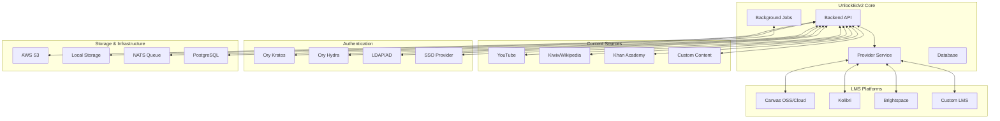
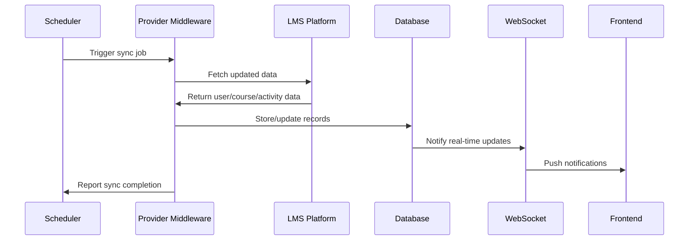

# Integration Patterns Documentation

This document provides comprehensive guidance for integrating UnlockEdv2 with external systems, including LMS platforms, content providers, authentication systems, and third-party services.

## 📋 Table of Contents
- [Integration Overview](#integration-overview)
- [LMS Platform Integrations](#lms-platform-integrations)
- [Content Provider Integrations](#content-provider-integrations)
- [Authentication Integrations](#authentication-integrations)
- [Message Queue Integration](#message-queue-integration)
- [File Storage Integration](#file-storage-integration)
- [API Integration Patterns](#api-integration-patterns)
- [Webhook Integration](#webhook-integration)
- [Monitoring Integration](#monitoring-integration)
- [Custom Integration Development](#custom-integration-development)
- [Security Considerations](#security-considerations)
- [Testing Integration](#testing-integration)

## 🔗 Integration Overview

UnlockEdv2 is designed as an integration-first educational platform that connects with various external systems to provide a comprehensive learning management experience for correctional facilities.

### Integration Architecture


### Integration Principles
- **Loosely Coupled**: Minimize dependencies between systems
- **Event-Driven**: Use message queues for asynchronous communication
- **Fault Tolerant**: Graceful degradation when external services fail
- **Secure**: All integrations use proper authentication and encryption
- **Auditable**: Comprehensive logging of integration activities
- **Scalable**: Support for multiple instances of external systems

---

## 🎓 LMS Platform Integrations

### Supported LMS Platforms

#### Canvas Integration
UnlockEdv2 supports both Canvas OSS (open source) and Canvas Cloud (commercial) platforms.

##### Configuration
```go
type CanvasConfig struct {
    Type        string `json:"type"`         // "canvas_oss" or "canvas_cloud"
    BaseURL     string `json:"base_url"`     // Canvas instance URL
    AccessToken string `json:"access_token"` // API access token
    AccountID   string `json:"account_id"`   // Canvas account ID
}
```

##### API Integration
```go
// Canvas API client implementation
type CanvasClient struct {
    BaseURL     string
    AccessToken string
    HTTPClient  *http.Client
}

func (c *CanvasClient) GetCourses() ([]Course, error) {
    url := fmt.Sprintf("%s/api/v1/accounts/%s/courses", c.BaseURL, c.AccountID)
    
    req, err := http.NewRequest("GET", url, nil)
    if err != nil {
        return nil, err
    }
    
    req.Header.Set("Authorization", "Bearer "+c.AccessToken)
    req.Header.Set("Accept", "application/json")
    
    resp, err := c.HTTPClient.Do(req)
    if err != nil {
        return nil, err
    }
    defer resp.Body.Close()
    
    var courses []Course
    return courses, json.NewDecoder(resp.Body).Decode(&courses)
}

func (c *CanvasClient) GetUserEnrollments(userID string) ([]Enrollment, error) {
    url := fmt.Sprintf("%s/api/v1/users/%s/enrollments", c.BaseURL, userID)
    // Implementation similar to GetCourses
}
```

##### OAuth2/OIDC Setup
```go
// Canvas OAuth2 configuration
type CanvasOAuth2Config struct {
    ClientID     string `json:"client_id"`
    ClientSecret string `json:"client_secret"`
    RedirectURI  string `json:"redirect_uri"`
    Scopes       []string `json:"scopes"`
}

// Register Canvas as OIDC client
func (srv *Server) registerCanvasOIDC(config CanvasOAuth2Config) error {
    // Create OIDC client in Ory Hydra
    client := &models.OidcClient{
        ClientID:           config.ClientID,
        ClientSecret:       config.ClientSecret,
        RedirectURIs:       config.RedirectURI,
        Scopes:            strings.Join(config.Scopes, " "),
        ProviderPlatformID: platformID,
    }
    
    return srv.Db.RegisterClient(client)
}
```

#### Kolibri Integration
Kolibri is an offline-first educational platform designed for low-resource environments.

##### Configuration
```go
type KolibriConfig struct {
    BaseURL  string `json:"base_url"`  // Kolibri server URL
    Username string `json:"username"`  // Admin username
    Password string `json:"password"`  // Admin password
}
```

##### API Integration
```go
type KolibriClient struct {
    BaseURL    string
    Username   string
    Password   string
    HTTPClient *http.Client
    SessionID  string
}

func (k *KolibriClient) authenticate() error {
    loginURL := fmt.Sprintf("%s/api/session/", k.BaseURL)
    
    credentials := map[string]string{
        "username": k.Username,
        "password": k.Password,
    }
    
    jsonData, _ := json.Marshal(credentials)
    req, _ := http.NewRequest("POST", loginURL, bytes.NewBuffer(jsonData))
    req.Header.Set("Content-Type", "application/json")
    
    resp, err := k.HTTPClient.Do(req)
    if err != nil {
        return err
    }
    defer resp.Body.Close()
    
    // Extract session ID from response
    var sessionResp struct {
        ID string `json:"id"`
    }
    json.NewDecoder(resp.Body).Decode(&sessionResp)
    k.SessionID = sessionResp.ID
    
    return nil
}

func (k *KolibriClient) GetLearningActivities(userID string) ([]Activity, error) {
    if k.SessionID == "" {
        if err := k.authenticate(); err != nil {
            return nil, err
        }
    }
    
    url := fmt.Sprintf("%s/api/logger/masterylog/", k.BaseURL)
    req, _ := http.NewRequest("GET", url, nil)
    req.Header.Set("Authorization", "Session "+k.SessionID)
    
    // Implementation continues...
}
```

#### Brightspace Integration
D2L Brightspace integration with comprehensive API support.

##### Configuration
```go
type BrightspaceConfig struct {
    BaseURL      string `json:"base_url"`      // Brightspace instance URL
    AppID        string `json:"app_id"`        // Application ID
    AppKey       string `json:"app_key"`       // Application key
    UserID       string `json:"user_id"`       // User context ID
    UserKey      string `json:"user_key"`      // User context key
}
```

##### Authentication (Brightspace-specific)
```go
func (b *BrightspaceClient) generateAuthURL(path string) (string, error) {
    timestamp := time.Now().Unix()
    
    // Create authentication signature
    baseString := fmt.Sprintf("GET&%s&%d", 
        url.QueryEscape(b.BaseURL+path), timestamp)
    
    // HMAC-SHA256 signature
    h := hmac.New(sha256.New, []byte(b.AppKey+"&"+b.UserKey))
    h.Write([]byte(baseString))
    signature := base64.StdEncoding.EncodeToString(h.Sum(nil))
    
    // Build authenticated URL
    authURL := fmt.Sprintf("%s%s?x_a=%s&x_b=%s&x_c=%s&x_d=%d&x_t=%s",
        b.BaseURL, path, b.AppID, b.UserID, 
        url.QueryEscape(signature), timestamp, "1")
    
    return authURL, nil
}
```

### Integration Workflow

#### Data Synchronization Process


#### Sync Job Configuration
```go
// Background job for LMS synchronization
type SyncJob struct {
    JobType            string    `json:"job_type"`
    ProviderPlatformID uint      `json:"provider_platform_id"`
    LastRun            time.Time `json:"last_run"`
    Parameters         map[string]interface{} `json:"parameters"`
}

// Job execution
func (job *SyncJob) Execute(ctx context.Context) error {
    provider, err := getProviderPlatform(job.ProviderPlatformID)
    if err != nil {
        return err
    }
    
    client, err := createProviderClient(provider)
    if err != nil {
        return err
    }
    
    switch job.JobType {
    case "sync_users":
        return job.syncUsers(ctx, client)
    case "sync_courses":
        return job.syncCourses(ctx, client)
    case "sync_activities":
        return job.syncActivities(ctx, client)
    default:
        return fmt.Errorf("unknown job type: %s", job.JobType)
    }
}
```

---

## 📚 Content Provider Integrations

### YouTube Content Integration

#### Video Content Management
```go
type YouTubeIntegration struct {
    APIKey     string
    HTTPClient *http.Client
}

func (y *YouTubeIntegration) GetVideoMetadata(videoID string) (*VideoMetadata, error) {
    url := fmt.Sprintf("https://www.googleapis.com/youtube/v3/videos?id=%s&part=snippet,contentDetails,statistics&key=%s",
        videoID, y.APIKey)
    
    resp, err := y.HTTPClient.Get(url)
    if err != nil {
        return nil, err
    }
    defer resp.Body.Close()
    
    var apiResp struct {
        Items []struct {
            Snippet struct {
                Title       string `json:"title"`
                Description string `json:"description"`
                Thumbnails  struct {
                    High struct {
                        URL string `json:"url"`
                    } `json:"high"`
                } `json:"thumbnails"`
                ChannelTitle string `json:"channelTitle"`
            } `json:"snippet"`
            ContentDetails struct {
                Duration string `json:"duration"`
            } `json:"contentDetails"`
        } `json:"items"`
    }
    
    if err := json.NewDecoder(resp.Body).Decode(&apiResp); err != nil {
        return nil, err
    }
    
    if len(apiResp.Items) == 0 {
        return nil, fmt.Errorf("video not found: %s", videoID)
    }
    
    item := apiResp.Items[0]
    duration := parseDuration(item.ContentDetails.Duration)
    
    return &VideoMetadata{
        Title:        item.Snippet.Title,
        Description:  item.Snippet.Description,
        ThumbnailURL: item.Snippet.Thumbnails.High.URL,
        ChannelTitle: item.Snippet.ChannelTitle,
        Duration:     duration,
    }, nil
}
```

#### Video Download and Processing
```go
// Video download using yt-dlp
func (y *YouTubeIntegration) DownloadVideo(videoURL, outputPath string) error {
    cmd := exec.Command("yt-dlp",
        "--format", "best[height<=720]", // Limit quality for storage
        "--output", filepath.Join(outputPath, "%(id)s.%(ext)s"),
        "--write-info-json",
        "--write-thumbnail",
        videoURL)
    
    output, err := cmd.CombinedOutput()
    if err != nil {
        return fmt.Errorf("yt-dlp failed: %s", output)
    }
    
    return nil
}

// Background processing job
func (job *VideoDownloadJob) Execute(ctx context.Context) error {
    video, err := job.getVideo()
    if err != nil {
        return err
    }
    
    // Update status to processing
    video.Availability = models.VideoProcessing
    job.updateVideo(video)
    
    // Download video
    if err := job.downloadVideo(video.ExternalURL); err != nil {
        video.Availability = models.VideoHasError
        job.updateVideo(video)
        return err
    }
    
    // Update status to available
    video.Availability = models.VideoAvailable
    return job.updateVideo(video)
}
```

### Kiwix Library Integration

#### ZIM File Management
```go
type KiwixIntegration struct {
    ServerURL  string
    LibraryPath string
}

func (k *KiwixIntegration) GetAvailableLibraries() ([]Library, error) {
    url := fmt.Sprintf("%s/catalog/v2/entries", k.ServerURL)
    
    resp, err := http.Get(url)
    if err != nil {
        return nil, err
    }
    defer resp.Body.Close()
    
    var catalog struct {
        Entries []struct {
            ID          string `json:"id"`
            Title       string `json:"title"`
            Description string `json:"description"`
            Language    string `json:"language"`
            URL         string `json:"url"`
            Size        int64  `json:"size"`
        } `json:"entries"`
    }
    
    if err := json.NewDecoder(resp.Body).Decode(&catalog); err != nil {
        return nil, err
    }
    
    var libraries []Library
    for _, entry := range catalog.Entries {
        libraries = append(libraries, Library{
            ExternalID:  entry.ID,
            Title:       entry.Title,
            Description: entry.Description,
            Language:    entry.Language,
            URL:         entry.URL,
            Size:        entry.Size,
        })
    }
    
    return libraries, nil
}
```

#### Content Proxy Implementation
```go
// Proxy requests to Kiwix content with access control
func (srv *Server) handleLibraryProxy(w http.ResponseWriter, r *http.Request) {
    libraryID := r.PathValue("id")
    contentPath := r.PathValue("path")
    
    // Get library configuration
    library, err := srv.getLibraryByID(libraryID)
    if err != nil {
        http.Error(w, "Library not found", http.StatusNotFound)
        return
    }
    
    // Check user permissions
    user := r.Context().Value(ClaimsKey).(*Claims)
    if !srv.canAccessLibrary(user, library) {
        http.Error(w, "Access denied", http.StatusForbidden)
        return
    }
    
    // Build proxy URL
    proxyURL := fmt.Sprintf("%s/%s/%s", srv.KiwixURL, library.ExternalID, contentPath)
    
    // Create proxy request
    proxyReq, err := http.NewRequest(r.Method, proxyURL, r.Body)
    if err != nil {
        http.Error(w, "Proxy request failed", http.StatusInternalServerError)
        return
    }
    
    // Copy headers
    for name, values := range r.Header {
        for _, value := range values {
            proxyReq.Header.Add(name, value)
        }
    }
    
    // Execute proxy request
    client := &http.Client{Timeout: 30 * time.Second}
    resp, err := client.Do(proxyReq)
    if err != nil {
        http.Error(w, "Backend request failed", http.StatusBadGateway)
        return
    }
    defer resp.Body.Close()
    
    // Copy response headers
    for name, values := range resp.Header {
        for _, value := range values {
            w.Header().Add(name, value)
        }
    }
    
    // Copy response
    w.WriteHeader(resp.StatusCode)
    io.Copy(w, resp.Body)
}
```

---

## 🔐 Authentication Integrations

### LDAP/Active Directory Integration

#### LDAP Configuration
```go
type LDAPConfig struct {
    URL            string `json:"url"`             // LDAP server URL
    BindDN         string `json:"bind_dn"`         // Bind DN for authentication
    BindPassword   string `json:"bind_password"`   // Bind password
    BaseDN         string `json:"base_dn"`         // Base DN for user search
    UserFilter     string `json:"user_filter"`     // User search filter
    UserAttributes struct {
        Username  string `json:"username"`   // Username attribute
        Email     string `json:"email"`      // Email attribute
        FirstName string `json:"first_name"` // First name attribute
        LastName  string `json:"last_name"`  // Last name attribute
    } `json:"user_attributes"`
}

type LDAPClient struct {
    Config *LDAPConfig
    Conn   *ldap.Conn
}

func (l *LDAPClient) Connect() error {
    conn, err := ldap.DialURL(l.Config.URL)
    if err != nil {
        return err
    }
    
    // Start TLS if required
    if strings.HasPrefix(l.Config.URL, "ldaps://") {
        err = conn.StartTLS(&tls.Config{InsecureSkipVerify: false})
        if err != nil {
            return err
        }
    }
    
    // Bind with service account
    err = conn.Bind(l.Config.BindDN, l.Config.BindPassword)
    if err != nil {
        return err
    }
    
    l.Conn = conn
    return nil
}

func (l *LDAPClient) AuthenticateUser(username, password string) (*LDAPUser, error) {
    // Search for user
    searchRequest := ldap.NewSearchRequest(
        l.Config.BaseDN,
        ldap.ScopeWholeSubtree, ldap.NeverDerefAliases, 0, 0, false,
        fmt.Sprintf(l.Config.UserFilter, username),
        []string{
            l.Config.UserAttributes.Username,
            l.Config.UserAttributes.Email,
            l.Config.UserAttributes.FirstName,
            l.Config.UserAttributes.LastName,
        },
        nil,
    )
    
    sr, err := l.Conn.Search(searchRequest)
    if err != nil {
        return nil, err
    }
    
    if len(sr.Entries) == 0 {
        return nil, fmt.Errorf("user not found: %s", username)
    }
    
    userEntry := sr.Entries[0]
    
    // Attempt to bind as the user to verify password
    err = l.Conn.Bind(userEntry.DN, password)
    if err != nil {
        return nil, fmt.Errorf("authentication failed: %s", err)
    }
    
    // Re-bind as service account
    l.Conn.Bind(l.Config.BindDN, l.Config.BindPassword)
    
    // Build user object
    user := &LDAPUser{
        DN:        userEntry.DN,
        Username:  userEntry.GetAttributeValue(l.Config.UserAttributes.Username),
        Email:     userEntry.GetAttributeValue(l.Config.UserAttributes.Email),
        FirstName: userEntry.GetAttributeValue(l.Config.UserAttributes.FirstName),
        LastName:  userEntry.GetAttributeValue(l.Config.UserAttributes.LastName),
    }
    
    return user, nil
}
```

#### LDAP Integration with Kratos
```go
// Custom identity provider for Kratos
func (srv *Server) handleLDAPLogin(w http.ResponseWriter, r *http.Request) error {
    var loginReq struct {
        Username string `json:"username"`
        Password string `json:"password"`
    }
    
    if err := json.NewDecoder(r.Body).Decode(&loginReq); err != nil {
        return newBadRequestServiceError(err, "Invalid request")
    }
    
    // Authenticate with LDAP
    ldapUser, err := srv.LDAP.AuthenticateUser(loginReq.Username, loginReq.Password)
    if err != nil {
        return newUnauthorizedServiceError()
    }
    
    // Find or create user in local database
    user, err := srv.findOrCreateLDAPUser(ldapUser)
    if err != nil {
        return newDatabaseServiceError(err)
    }
    
    // Create or update Kratos identity
    identity, err := srv.syncUserWithKratos(user)
    if err != nil {
        return newInternalServerServiceError(err, "Failed to sync with auth system")
    }
    
    // Generate session
    session, err := srv.createKratosSession(identity.ID)
    if err != nil {
        return newInternalServerServiceError(err, "Failed to create session")
    }
    
    // Set session cookie
    http.SetCookie(w, &http.Cookie{
        Name:     "ory_kratos_session",
        Value:    session.ID,
        Path:     "/",
        HttpOnly: true,
        Secure:   true,
        SameSite: http.SameSiteLaxMode,
    })
    
    return writeJsonResponse(w, http.StatusOK, map[string]string{
        "message": "Login successful",
        "redirect": "/dashboard",
    })
}
```

### Single Sign-On (SSO) Integration

#### SAML 2.0 Integration
```go
type SAMLConfig struct {
    EntityID          string `json:"entity_id"`
    SSOURL           string `json:"sso_url"`
    Certificate      string `json:"certificate"`
    PrivateKey       string `json:"private_key"`
    AttributeMapping struct {
        Username  string `json:"username"`
        Email     string `json:"email"`
        FirstName string `json:"first_name"`
        LastName  string `json:"last_name"`
        Role      string `json:"role"`
    } `json:"attribute_mapping"`
}

func (srv *Server) handleSAMLCallback(w http.ResponseWriter, r *http.Request) error {
    // Parse SAML response
    samlResponse := r.FormValue("SAMLResponse")
    if samlResponse == "" {
        return newBadRequestServiceError(errors.New("missing SAML response"), "Invalid SAML response")
    }
    
    // Decode and validate SAML assertion
    assertion, err := srv.validateSAMLAssertion(samlResponse)
    if err != nil {
        return newUnauthorizedServiceError()
    }
    
    // Extract user attributes
    attributes := assertion.AttributeStatement.Attributes
    user := &models.User{
        Username:  getAttributeValue(attributes, srv.SAMLConfig.AttributeMapping.Username),
        Email:     getAttributeValue(attributes, srv.SAMLConfig.AttributeMapping.Email),
        NameFirst: getAttributeValue(attributes, srv.SAMLConfig.AttributeMapping.FirstName),
        NameLast:  getAttributeValue(attributes, srv.SAMLConfig.AttributeMapping.LastName),
    }
    
    // Map role from SAML attributes
    roleAttr := getAttributeValue(attributes, srv.SAMLConfig.AttributeMapping.Role)
    user.Role = mapSAMLRoleToLocalRole(roleAttr)
    
    // Find or create user
    existingUser, err := srv.Db.GetUserByUsername(user.Username)
    if err == nil {
        // Update existing user
        existingUser.Email = user.Email
        existingUser.NameFirst = user.NameFirst
        existingUser.NameLast = user.NameLast
        existingUser.Role = user.Role
        err = srv.Db.UpdateUser(existingUser)
        user = existingUser
    } else {
        // Create new user
        err = srv.Db.CreateUser(user)
    }
    
    if err != nil {
        return newDatabaseServiceError(err)
    }
    
    // Create Kratos session
    claims := claimsFromUser(user)
    sessionToken, err := srv.createSessionToken(claims)
    if err != nil {
        return newInternalServerServiceError(err, "Failed to create session")
    }
    
    // Redirect with session
    http.Redirect(w, r, "/dashboard?token="+sessionToken, http.StatusFound)
    return nil
}
```

---

## 📨 Message Queue Integration

### NATS Configuration and Usage

#### NATS Server Setup
```yaml
# nats-server.conf
port: 4222
http_port: 8222

jetstream: {
  store_dir: "/data/nats/jetstream"
  max_memory_store: 1GB
  max_file_store: 10GB
}

cluster: {
  name: unlocked_cluster
  listen: 0.0.0.0:6222
  routes: [
    nats://nats1:6222
    nats://nats2:6222
  ]
}

accounts: {
  unlocked: {
    users: [
      {
        user: "unlocked_service"
        password: "$2a$11$..."
        permissions: {
          publish: ["unlocked.>"]
          subscribe: ["unlocked.>", "_INBOX.>"]
        }
      }
    ]
    jetstream: enabled
  }
}
```

#### Job Publisher
```go
type JobPublisher struct {
    nc   *nats.Conn
    js   nats.JetStreamContext
}

func NewJobPublisher(natsURL string) (*JobPublisher, error) {
    nc, err := nats.Connect(natsURL)
    if err != nil {
        return nil, err
    }
    
    js, err := nc.JetStream()
    if err != nil {
        return nil, err
    }
    
    return &JobPublisher{nc: nc, js: js}, nil
}

func (jp *JobPublisher) PublishSyncJob(job *SyncJob) error {
    data, err := json.Marshal(job)
    if err != nil {
        return err
    }
    
    subject := fmt.Sprintf("unlocked.sync.%s", job.JobType)
    
    _, err = jp.js.Publish(subject, data, nats.MsgId(job.ID))
    if err != nil {
        return fmt.Errorf("failed to publish job: %w", err)
    }
    
    log.Printf("Published job %s to subject %s", job.ID, subject)
    return nil
}
```

#### Job Consumer
```go
type JobConsumer struct {
    nc   *nats.Conn
    js   nats.JetStreamContext
    db   *database.DB
}

func (jc *JobConsumer) StartConsuming() error {
    // Subscribe to sync jobs
    _, err := jc.js.QueueSubscribe("unlocked.sync.*", "sync_workers", jc.handleSyncJob, 
        nats.Durable("sync_consumer"),
        nats.ManualAck(),
        nats.MaxDeliver(3))
    
    if err != nil {
        return fmt.Errorf("failed to subscribe to sync jobs: %w", err)
    }
    
    log.Println("Started consuming sync jobs")
    return nil
}

func (jc *JobConsumer) handleSyncJob(msg *nats.Msg) {
    var job SyncJob
    if err := json.Unmarshal(msg.Data, &job); err != nil {
        log.Printf("Failed to unmarshal job: %v", err)
        msg.Nak()
        return
    }
    
    log.Printf("Processing job %s of type %s", job.ID, job.JobType)
    
    // Execute job
    if err := job.Execute(context.Background()); err != nil {
        log.Printf("Job %s failed: %v", job.ID, err)
        
        // Check if we should retry
        meta, _ := msg.Metadata()
        if meta.NumDelivered < 3 {
            msg.Nak()
            return
        }
        
        // Max retries exceeded, move to dead letter queue
        jc.handleFailedJob(&job, err)
    }
    
    // Acknowledge successful processing
    msg.Ack()
    log.Printf("Job %s completed successfully", job.ID)
}
```

### Background Job Processing

#### Job Scheduling
```go
type JobScheduler struct {
    publisher *JobPublisher
    db        *database.DB
    cron      *gocron.Scheduler
}

func (js *JobScheduler) Start() error {
    // Schedule regular sync jobs
    _, err := js.cron.Every(1).Hour().Do(js.scheduleSyncJobs)
    if err != nil {
        return err
    }
    
    // Schedule daily reporting
    _, err = js.cron.Every(1).Day().At("03:00").Do(js.scheduleDailyReport)
    if err != nil {
        return err
    }
    
    js.cron.StartAsync()
    return nil
}

func (js *JobScheduler) scheduleSyncJobs() error {
    providers, err := js.db.GetActiveProviderPlatforms()
    if err != nil {
        return err
    }
    
    for _, provider := range providers {
        jobs := []SyncJob{
            {
                JobType:            "sync_users",
                ProviderPlatformID: provider.ID,
                Parameters: map[string]interface{}{
                    "last_sync": time.Now().Add(-1 * time.Hour),
                },
            },
            {
                JobType:            "sync_courses",
                ProviderPlatformID: provider.ID,
                Parameters: map[string]interface{}{
                    "last_sync": time.Now().Add(-1 * time.Hour),
                },
            },
        }
        
        for _, job := range jobs {
            if err := js.publisher.PublishSyncJob(&job); err != nil {
                log.Printf("Failed to schedule job %s: %v", job.JobType, err)
            }
        }
    }
    
    return nil
}
```

---

## 💾 File Storage Integration

### AWS S3 Integration

#### S3 Configuration
```go
type S3Config struct {
    Region          string `json:"region"`
    BucketName      string `json:"bucket_name"`
    AccessKeyID     string `json:"access_key_id"`
    SecretAccessKey string `json:"secret_access_key"`
    Endpoint        string `json:"endpoint,omitempty"` // For S3-compatible services
}

type S3Client struct {
    client *s3.S3
    bucket string
}

func NewS3Client(config *S3Config) (*S3Client, error) {
    sess, err := session.NewSession(&aws.Config{
        Region:      aws.String(config.Region),
        Credentials: credentials.NewStaticCredentials(
            config.AccessKeyID, 
            config.SecretAccessKey, 
            ""),
        Endpoint: aws.String(config.Endpoint),
    })
    if err != nil {
        return nil, err
    }
    
    return &S3Client{
        client: s3.New(sess),
        bucket: config.BucketName,
    }, nil
}
```

#### File Upload and Management
```go
func (s3c *S3Client) UploadFile(key string, data io.Reader, contentType string) error {
    _, err := s3c.client.PutObject(&s3.PutObjectInput{
        Bucket:      aws.String(s3c.bucket),
        Key:         aws.String(key),
        Body:        aws.ReadSeekCloser(data),
        ContentType: aws.String(contentType),
        ServerSideEncryption: aws.String("AES256"),
    })
    
    return err
}

func (s3c *S3Client) GetPresignedURL(key string, expiration time.Duration) (string, error) {
    req, _ := s3c.client.GetObjectRequest(&s3.GetObjectInput{
        Bucket: aws.String(s3c.bucket),
        Key:    aws.String(key),
    })
    
    return req.Presign(expiration)
}

func (s3c *S3Client) DeleteFile(key string) error {
    _, err := s3c.client.DeleteObject(&s3.DeleteObjectInput{
        Bucket: aws.String(s3c.bucket),
        Key:    aws.String(key),
    })
    
    return err
}

// Video upload handler with S3 integration
func (srv *Server) handleVideoUpload(w http.ResponseWriter, r *http.Request) error {
    file, header, err := r.FormFile("video")
    if err != nil {
        return newBadRequestServiceError(err, "Failed to parse file")
    }
    defer file.Close()
    
    // Validate file type
    if !isValidVideoType(header.Header.Get("Content-Type")) {
        return newBadRequestServiceError(errors.New("invalid file type"), 
            "Only MP4, WebM, and AVI files are supported")
    }
    
    // Generate unique filename
    videoID := uuid.New().String()
    filename := fmt.Sprintf("videos/%s/%s", videoID, header.Filename)
    
    // Upload to S3
    err = srv.S3.UploadFile(filename, file, header.Header.Get("Content-Type"))
    if err != nil {
        return newInternalServerServiceError(err, "Failed to upload file")
    }
    
    // Create video record
    video := &models.Video{
        ExternalID:   videoID,
        Title:        strings.TrimSuffix(header.Filename, filepath.Ext(header.Filename)),
        URL:          filename, // S3 key
        Availability: models.VideoProcessing,
        // ... other fields
    }
    
    err = srv.Db.CreateVideo(video)
    if err != nil {
        // Clean up S3 file on database error
        srv.S3.DeleteFile(filename)
        return newDatabaseServiceError(err)
    }
    
    // Queue video processing job
    job := &VideoProcessingJob{VideoID: video.ID}
    srv.JobPublisher.PublishJob(job)
    
    return writeJsonResponse(w, http.StatusCreated, video)
}
```

### Local File Storage
```go
type LocalStorage struct {
    BasePath string
}

func (ls *LocalStorage) SaveFile(filename string, data io.Reader) error {
    fullPath := filepath.Join(ls.BasePath, filename)
    
    // Ensure directory exists
    dir := filepath.Dir(fullPath)
    if err := os.MkdirAll(dir, 0755); err != nil {
        return err
    }
    
    // Create file
    file, err := os.Create(fullPath)
    if err != nil {
        return err
    }
    defer file.Close()
    
    // Copy data
    _, err = io.Copy(file, data)
    return err
}

func (ls *LocalStorage) GetFilePath(filename string) string {
    return filepath.Join(ls.BasePath, filename)
}

func (ls *LocalStorage) DeleteFile(filename string) error {
    fullPath := filepath.Join(ls.BasePath, filename)
    return os.Remove(fullPath)
}
```

---

## 🔌 API Integration Patterns

### RESTful API Design

#### Standard Response Format
```go
type APIResponse struct {
    Data       interface{} `json:"data,omitempty"`
    Message    string      `json:"message,omitempty"`
    Error      *APIError   `json:"error,omitempty"`
    Timestamp  time.Time   `json:"timestamp"`
    RequestID  string      `json:"request_id,omitempty"`
}

type APIError struct {
    Code    string      `json:"code"`
    Message string      `json:"message"`
    Details interface{} `json:"details,omitempty"`
}

func writeJSONResponse(w http.ResponseWriter, status int, data interface{}) error {
    response := APIResponse{
        Data:      data,
        Timestamp: time.Now().UTC(),
        RequestID: getRequestID(r.Context()),
    }
    
    w.Header().Set("Content-Type", "application/json")
    w.WriteHeader(status)
    return json.NewEncoder(w).Encode(response)
}
```

#### Pagination Support
```go
type PaginatedResponse struct {
    Data       interface{} `json:"data"`
    Pagination struct {
        CurrentPage int  `json:"current_page"`
        PerPage     int  `json:"per_page"`
        TotalPages  int  `json:"total_pages"`
        TotalCount  int  `json:"total_count"`
        HasNext     bool `json:"has_next"`
        HasPrev     bool `json:"has_prev"`
    } `json:"pagination"`
}

func (srv *Server) handlePaginatedRequest(w http.ResponseWriter, r *http.Request, 
    query func(offset, limit int) ([]interface{}, int, error)) error {
    
    page, _ := strconv.Atoi(r.URL.Query().Get("page"))
    if page < 1 {
        page = 1
    }
    
    perPage, _ := strconv.Atoi(r.URL.Query().Get("per_page"))
    if perPage < 1 || perPage > 100 {
        perPage = 20
    }
    
    offset := (page - 1) * perPage
    
    data, total, err := query(offset, perPage)
    if err != nil {
        return newDatabaseServiceError(err)
    }
    
    totalPages := int(math.Ceil(float64(total) / float64(perPage)))
    
    response := PaginatedResponse{
        Data: data,
        Pagination: struct {
            CurrentPage int  `json:"current_page"`
            PerPage     int  `json:"per_page"`
            TotalPages  int  `json:"total_pages"`
            TotalCount  int  `json:"total_count"`
            HasNext     bool `json:"has_next"`
            HasPrev     bool `json:"has_prev"`
        }{
            CurrentPage: page,
            PerPage:     perPage,
            TotalPages:  totalPages,
            TotalCount:  total,
            HasNext:     page < totalPages,
            HasPrev:     page > 1,
        },
    }
    
    return writeJSONResponse(w, http.StatusOK, response)
}
```

### Rate Limiting
```go
type RateLimiter struct {
    requests map[string]*UserRequests
    mutex    sync.RWMutex
    limit    int
    window   time.Duration
}

type UserRequests struct {
    Count     int
    ResetTime time.Time
}

func NewRateLimiter(limit int, window time.Duration) *RateLimiter {
    return &RateLimiter{
        requests: make(map[string]*UserRequests),
        limit:    limit,
        window:   window,
    }
}

func (rl *RateLimiter) Allow(userID string) bool {
    rl.mutex.Lock()
    defer rl.mutex.Unlock()
    
    now := time.Now()
    
    userReqs, exists := rl.requests[userID]
    if !exists || now.After(userReqs.ResetTime) {
        rl.requests[userID] = &UserRequests{
            Count:     1,
            ResetTime: now.Add(rl.window),
        }
        return true
    }
    
    if userReqs.Count >= rl.limit {
        return false
    }
    
    userReqs.Count++
    return true
}

func (srv *Server) rateLimitMiddleware(next http.Handler) http.Handler {
    return http.HandlerFunc(func(w http.ResponseWriter, r *http.Request) {
        userID := getUserIDFromRequest(r)
        
        if !srv.rateLimiter.Allow(userID) {
            http.Error(w, "Rate limit exceeded", http.StatusTooManyRequests)
            return
        }
        
        next.ServeHTTP(w, r)
    })
}
```

---

## 🪝 Webhook Integration

### Webhook Configuration
```go
type WebhookConfig struct {
    URL       string            `json:"url"`
    Secret    string            `json:"secret"`
    Events    []string          `json:"events"`
    Headers   map[string]string `json:"headers"`
    Retries   int               `json:"retries"`
    Timeout   time.Duration     `json:"timeout"`
}

type WebhookPayload struct {
    Event     string      `json:"event"`
    Timestamp time.Time   `json:"timestamp"`
    Data      interface{} `json:"data"`
    Signature string      `json:"signature,omitempty"`
}
```

### Webhook Delivery System
```go
type WebhookDelivery struct {
    config *WebhookConfig
    client *http.Client
}

func NewWebhookDelivery(config *WebhookConfig) *WebhookDelivery {
    return &WebhookDelivery{
        config: config,
        client: &http.Client{
            Timeout: config.Timeout,
        },
    }
}

func (wd *WebhookDelivery) Send(event string, data interface{}) error {
    payload := WebhookPayload{
        Event:     event,
        Timestamp: time.Now().UTC(),
        Data:      data,
    }
    
    payloadBytes, err := json.Marshal(payload)
    if err != nil {
        return err
    }
    
    // Generate signature if secret is configured
    if wd.config.Secret != "" {
        h := hmac.New(sha256.New, []byte(wd.config.Secret))
        h.Write(payloadBytes)
        payload.Signature = hex.EncodeToString(h.Sum(nil))
        
        payloadBytes, _ = json.Marshal(payload)
    }
    
    return wd.sendWithRetries(payloadBytes)
}

func (wd *WebhookDelivery) sendWithRetries(payload []byte) error {
    var lastErr error
    
    for i := 0; i <= wd.config.Retries; i++ {
        if i > 0 {
            // Exponential backoff
            time.Sleep(time.Duration(math.Pow(2, float64(i))) * time.Second)
        }
        
        req, err := http.NewRequest("POST", wd.config.URL, bytes.NewBuffer(payload))
        if err != nil {
            return err
        }
        
        req.Header.Set("Content-Type", "application/json")
        req.Header.Set("User-Agent", "UnlockEd-Webhook/1.0")
        
        // Add custom headers
        for key, value := range wd.config.Headers {
            req.Header.Set(key, value)
        }
        
        resp, err := wd.client.Do(req)
        if err != nil {
            lastErr = err
            continue
        }
        
        if resp.StatusCode >= 200 && resp.StatusCode < 300 {
            resp.Body.Close()
            return nil // Success
        }
        
        body, _ := io.ReadAll(resp.Body)
        resp.Body.Close()
        lastErr = fmt.Errorf("webhook failed: %d %s", resp.StatusCode, string(body))
    }
    
    return lastErr
}
```

### Event Publishing
```go
type EventPublisher struct {
    webhooks []*WebhookDelivery
    queue    chan WebhookEvent
}

type WebhookEvent struct {
    Name string
    Data interface{}
}

func (ep *EventPublisher) Start() {
    go ep.processEvents()
}

func (ep *EventPublisher) Publish(event string, data interface{}) {
    select {
    case ep.queue <- WebhookEvent{Name: event, Data: data}:
    default:
        log.Printf("Webhook queue full, dropping event: %s", event)
    }
}

func (ep *EventPublisher) processEvents() {
    for event := range ep.queue {
        for _, webhook := range ep.webhooks {
            if slices.Contains(webhook.config.Events, event.Name) {
                go func(wh *WebhookDelivery, evt WebhookEvent) {
                    if err := wh.Send(evt.Name, evt.Data); err != nil {
                        log.Printf("Webhook delivery failed: %v", err)
                    }
                }(webhook, event)
            }
        }
    }
}

// Usage in handlers
func (srv *Server) handleUserCreated(user *models.User) {
    srv.eventPublisher.Publish("user.created", map[string]interface{}{
        "user_id":     user.ID,
        "username":    user.Username,
        "facility_id": user.FacilityID,
        "role":        user.Role,
    })
}
```

---

## 📊 Monitoring Integration

### Prometheus Metrics
```go
var (
    httpRequestsTotal = prometheus.NewCounterVec(
        prometheus.CounterOpts{
            Name: "http_requests_total",
            Help: "Total number of HTTP requests",
        },
        []string{"method", "endpoint", "status_code"},
    )
    
    httpRequestDuration = prometheus.NewHistogramVec(
        prometheus.HistogramOpts{
            Name: "http_request_duration_seconds",
            Help: "HTTP request duration in seconds",
        },
        []string{"method", "endpoint"},
    )
    
    activeUsers = prometheus.NewGauge(
        prometheus.GaugeOpts{
            Name: "active_users",
            Help: "Number of currently active users",
        },
    )
    
    databaseConnections = prometheus.NewGauge(
        prometheus.GaugeOpts{
            Name: "database_connections",
            Help: "Number of active database connections",
        },
    )
)

func init() {
    prometheus.MustRegister(httpRequestsTotal)
    prometheus.MustRegister(httpRequestDuration)
    prometheus.MustRegister(activeUsers)
    prometheus.MustRegister(databaseConnections)
}

func prometheusMiddleware(next http.Handler) http.Handler {
    return http.HandlerFunc(func(w http.ResponseWriter, r *http.Request) {
        start := time.Now()
        
        // Wrap ResponseWriter to capture status code
        wrapped := &responseWrapper{ResponseWriter: w, statusCode: 200}
        
        next.ServeHTTP(wrapped, r)
        
        duration := time.Since(start)
        statusCode := strconv.Itoa(wrapped.statusCode)
        
        httpRequestsTotal.WithLabelValues(r.Method, r.URL.Path, statusCode).Inc()
        httpRequestDuration.WithLabelValues(r.Method, r.URL.Path).Observe(duration.Seconds())
    })
}
```

### Health Check Integration
```go
type HealthChecker struct {
    db     *database.DB
    nats   *nats.Conn
    checks map[string]HealthCheck
}

type HealthCheck func() error

func (hc *HealthChecker) RegisterCheck(name string, check HealthCheck) {
    hc.checks[name] = check
}

func (hc *HealthChecker) GetStatus() map[string]interface{} {
    status := map[string]interface{}{
        "status":    "healthy",
        "timestamp": time.Now().UTC(),
        "checks":    make(map[string]string),
    }
    
    allHealthy := true
    
    for name, check := range hc.checks {
        if err := check(); err != nil {
            status["checks"].(map[string]string)[name] = "unhealthy: " + err.Error()
            allHealthy = false
        } else {
            status["checks"].(map[string]string)[name] = "healthy"
        }
    }
    
    if !allHealthy {
        status["status"] = "unhealthy"
    }
    
    return status
}

// Register health checks
func (srv *Server) registerHealthChecks() {
    srv.healthChecker.RegisterCheck("database", func() error {
        return srv.Db.Raw("SELECT 1").Error
    })
    
    srv.healthChecker.RegisterCheck("nats", func() error {
        if srv.Nats.IsClosed() {
            return errors.New("NATS connection closed")
        }
        return nil
    })
    
    srv.healthChecker.RegisterCheck("disk_space", func() error {
        // Check available disk space
        stat := syscall.Statfs_t{}
        err := syscall.Statfs("/", &stat)
        if err != nil {
            return err
        }
        
        available := stat.Bavail * uint64(stat.Bsize)
        if available < 1<<30 { // Less than 1GB
            return errors.New("low disk space")
        }
        
        return nil
    })
}
```

---

## 🛠️ Custom Integration Development

### Integration Framework
```go
type Integration interface {
    Name() string
    Version() string
    Initialize(config map[string]interface{}) error
    Sync(ctx context.Context) error
    Authenticate(credentials map[string]string) error
    GetUsers() ([]User, error)
    GetCourses() ([]Course, error)
    GetActivities(userID string, since time.Time) ([]Activity, error)
    Shutdown() error
}

type BaseIntegration struct {
    name    string
    version string
    config  map[string]interface{}
    client  *http.Client
}

func (bi *BaseIntegration) Name() string    { return bi.name }
func (bi *BaseIntegration) Version() string { return bi.version }

func (bi *BaseIntegration) Initialize(config map[string]interface{}) error {
    bi.config = config
    bi.client = &http.Client{
        Timeout: 30 * time.Second,
    }
    return nil
}
```

### Custom Integration Example
```go
// Example: Moodle integration
type MoodleIntegration struct {
    BaseIntegration
    token   string
    baseURL string
}

func NewMoodleIntegration() *MoodleIntegration {
    return &MoodleIntegration{
        BaseIntegration: BaseIntegration{
            name:    "moodle",
            version: "1.0.0",
        },
    }
}

func (m *MoodleIntegration) Initialize(config map[string]interface{}) error {
    if err := m.BaseIntegration.Initialize(config); err != nil {
        return err
    }
    
    var ok bool
    if m.baseURL, ok = config["base_url"].(string); !ok {
        return errors.New("missing base_url in config")
    }
    
    if m.token, ok = config["token"].(string); !ok {
        return errors.New("missing token in config")
    }
    
    return nil
}

func (m *MoodleIntegration) GetCourses() ([]Course, error) {
    url := fmt.Sprintf("%s/webservice/rest/server.php", m.baseURL)
    
    params := url.Values{}
    params.Set("wstoken", m.token)
    params.Set("wsfunction", "core_course_get_courses")
    params.Set("moodlewsrestformat", "json")
    
    resp, err := m.client.PostForm(url, params)
    if err != nil {
        return nil, err
    }
    defer resp.Body.Close()
    
    var moodleCourses []struct {
        ID       int    `json:"id"`
        FullName string `json:"fullname"`
        Summary  string `json:"summary"`
    }
    
    if err := json.NewDecoder(resp.Body).Decode(&moodleCourses); err != nil {
        return nil, err
    }
    
    var courses []Course
    for _, mc := range moodleCourses {
        courses = append(courses, Course{
            ExternalID:  strconv.Itoa(mc.ID),
            Name:        mc.FullName,
            Description: mc.Summary,
        })
    }
    
    return courses, nil
}

// Register integration
func (srv *Server) registerCustomIntegrations() {
    srv.integrationRegistry.Register("moodle", NewMoodleIntegration)
    srv.integrationRegistry.Register("blackboard", NewBlackboardIntegration)
    srv.integrationRegistry.Register("schoology", NewSchoologyIntegration)
}
```

This comprehensive integration documentation provides developers with detailed patterns and examples for connecting UnlockEdv2 with various external systems, ensuring secure, reliable, and maintainable integrations.